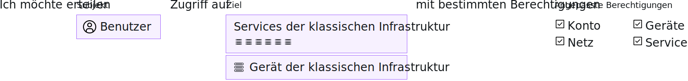

---

copyright:

  years: 2017, 2019

lastupdated: "2019-05-14"

keywords: SoftLayer permissions, classic infrastructure access, classic infrastructure permission, migrated SoftLayer permissions, migrated permission access group

subcollection: iam

---

{:shortdesc: .shortdesc}
{:codeblock: .codeblock}
{:screen: .screen}
{:important: .important}
{:new_window: target="_blank"}

# Berechtigungen für die klassische Infrastruktur
{: #infrapermission}

Wenn Sie einen Benutzer zu Ihrem Konto einladen, können Sie zwischen drei Berechtigungssets für die klassische Infrastruktur wählen, mit denen eine Massenzuweisung des Zugriffs erfolgt: 'Nur anzeigen', 'Basisbenutzer' und 'Superuser'.
{:shortdesc}

Wenn Sie jemanden zum Konto einladen, können nur Sie, der Kontoeigner, oder ein Benutzer mit der Berechtigung der klassischen Infrastruktur zum Verwalten von Benutzern die Berechtigungen für den Benutzer anpassen. Wenn Sie nicht der Kontoeigner sind, können Sie nur Berechtigungen der Berechtigungsebene, die Ihnen bereits zugewiesen sind, bzw. eine Untergruppe dieser Berechtigungen zuweisen. Ein Kontoeigner kann die Berechtigungen eines jeden Benutzers in dem Konto so aktualisieren, dass der Benutzer eine beliebige Zugriffsebene erhält.

Zusätzliche Berechtigungen können festgelegt werden, nachdem der Benutzer die Einladung angenommen hat. Mit dem Ausgangsberechtigungsset, das der Einladung zugewiesen ist, wird beispielsweise kein Zugriff auf Geräte erteilt. Daher müssen Sie den Gerätezugriff erteilen, nachdem der Benutzer die Einladung akzeptiert hat. Weitere Informationen hierzu enthält der Abschnitt [Zugriff auf die klassische Infrastruktur verwalten](/docs/iam?topic=iam-mngclassicinfra#mngclassicinfra).

In der folgenden Abbildung wird dargestellt, wie Berechtigungen für die klassische Infrastruktur pro Benutzer zugeordnet werden. Sie können jedem Benutzer Zugriff auf einen klassischen Infrastrukturservice oder auf ein Gerät gewähren, indem Sie aus den detaillierten Berechtigungsoptionen eine Auswahl treffen, um den Zugriff jedes Benutzers anzupassen.

## Migrierte Berechtigungen der klassischen Infrastruktur
{: #predefined}

Eine Reihe von Berechtigungen der klassischen Infrastruktur zum Anzeigen und Verwalten von Abrechnungsinformationen und zum Arbeiten mit Supportfällen wird jetzt zu Zugriffsgruppen migriert. Die Benutzer in Ihrem Konto, denen zuvor diese Berechtigungen zugewiesen waren, werden nun der jeweiligen Zugriffsgruppe für die migrierte Berechtigung zugewiesen. Demzufolge können Berechtigungen für die klassische Infrastruktur jetzt mithilfe von IAM-Zugriffsrichtlinien direkt verwaltet werden. Weitere Informationen zu den migrierten Berechtigungen und den jeweils verwendeten Zugriffsgruppen finden Sie in [Migrierte SoftLayer-Kontoberechtigungen verwalten](/docs/iam?topic=iam-migrated_permissions).
