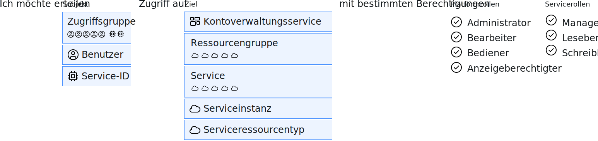

---

copyright:

  years: 2015, 2019

lastupdated: "2019-04-03"

keywords: IAM access, access policy, IAM roles, platform management roles, service access roles, types of access policies

subcollection: iam

---

{:shortdesc: .shortdesc}
{:codeblock: .codeblock}
{:screen: .screen}
{:tip: .tip}
{:note: .note}
{:new_window: target="_blank"}

# IAM-Zugriff
{: #userroles}

Alle Services, die in einer Ressourcengruppe in Ihrem Konto zusammengefasst sind, werden mithilfe von {{site.data.keyword.Bluemix_notm}} Identity and Access Management (IAM) verwaltet. Kontoeignern wird automatisch die Kontoadministratorrolle für Cloud IAM zugewiesen. Als Kontoadministrator können Sie den Zugriff für Benutzer zuordnen und verwalten, Ressourcengruppen erstellen, Zugriffsgruppen erstellen, Details zur Abrechnung und Nutzungsverfolgung anzeigen sowie Serviceinstanzen erstellen. Sie ermöglichen den Zugriff für Benutzer, Service-IDs und Zugriffsgruppen, indem Sie Richtlinien erstellen, die ein Zugriffsziel für das Richtliniensubjekt festlegen, sowie eine Rolle, die die Art des zulässigen Zugriffs definiert.
{: shortdesc}

## Was sind Cloud IAM-Richtlinien und wer kann sie zuweisen?
{: #iamusermanpol}

Eine Richtlinie weist einem Subjekt eine oder mehrere Rollen für eine Gruppe von Ressourcen zu, sodass im Kontext der angegebenen Zielressourcen bestimmte Aktionen ausgeführt werden können.

Mit der folgenden Abbildung wird Ihnen erläutert, wie die IAM-Richtlinie erstellt wird. Richtlinien werden immer erstellt, indem zunächst das Subjekt angegeben wird. Das Subjekt ist eine bestimmte Benutzer- oder Service-ID oder eine Benutzergruppe. Als Nächstes wird das Ziel der Richtlinie ausgewählt, das dem Benutzer Zugriff gewährt, z. B. auf alle Services in einer Ressourcengruppe, auf alle IAM-fähigen Services im Konto, auf Kontenverwaltungsservices oder auf eine bestimmte Serviceinstanz. Zum Schluss vervollständigen Sie Ihre Zugriffsrichtlinie, indem Sie aus den verfügbaren Rollen eine Auswahl treffen. Diese Rollen definieren genau, welche Aktionen ein Benutzer ausführen kann. Abhängig von dem Service, den Sie auswählen, können weitere Konfigurationsoptionen verfügbar sein.

Sie können Richtlinien zuweisen und verwalten, wenn Sie die entsprechende Rolle haben. In der folgenden Tabelle werden die Richtlinienmanagementtasks und die jeweils erforderliche Rolle aufgeführt.

| Aktion | Erforderliche Rolle |
|----------|---------|
| Richtlinie für ein Konto für alle Services und Instanzen erstellen | Kontoeigner oder Administrator für alle Kontoverwaltungsservices und alle Services mit aktiviertem Identity and Access Management |
| Richtlinie für einen Service in einem Konto erstellen | Kontoeigner, Administrator für alle Services mit aktiviertem Identity and Access Management oder Administrator für den Service im Konto |
| Richtlinie für eine Serviceinstanz erstellen | Kontoeigner, Administrator für alle Services mit aktiviertem Identity and Access Management, Administrator für den Service im Konto, Administrator für alle Services in der betreffenden Ressourcengruppe oder Administrator für die Serviceinstanz |
{: caption="Tabelle 1. Benutzer, die Zugriffsrichtlinien erstellen dürfen" caption-side="top"}

## Allgemeine Typen von Zugriffsrichtlinien
{: #policytypes}

Sie können differenzierten Zugriff für Benutzer, Service-IDs oder Zugriffsgruppen bereitstellen, indem Sie die folgenden Typen von Zugriffsrichtlinien zuordnen:

* Alle Kontoverwaltungsservices.
* Spezifischer Kontoverwaltungsservice.
* Alle Ressourcen im Konto
* Alle Ressourcen in allen Services, die einer einzelnen Ressourcengruppe angehören, mit der Möglichkeit, die Ressourcengruppe zu verwalten.
* Alle Ressourcen innerhalb eines einzelnen Service in einer Ressourcengruppe, mit der Möglichkeit, die Ressourcengruppe zu verwalten.
* Alle Ressourcen in einem einzelnen Service innerhalb des gesamten Kontos unabhängig von der Ressourcengruppe, der sie zugewiesen sind.
* Ressourcen in einer einzelnen Instanz.
* Ein einzelner Ressourcentyp in einer Instanz, z. B. ein Bucket in einer {{site.data.keyword.objectstorageshort}}-Instanz.

Um einem weiteren Benutzer uneingeschränkten Zugriff auf das Konto zum Zweck der Verwaltung des Benutzerzugriffs und der Verwaltung aller Kontoressourcen zu erteilen, müssen Sie zwei Richtlinien zuweisen. Eine Richtlinie, die dem Benutzer Zugriff auf alle Ressourcen im Konto gibt, indem Sie **Alle Services mit aktiviertem Identity and Access Management** mit zugewiesenen Rollen **Manager** auswählen. Zusätzlich eine Richtlinie, die dem Benutzer Zugriff auf alle Kontoverwaltungsservices im Konto gibt, indem Sie **Alle Kontoverwaltungsservices** mit zugewiesener Rolle **Administrator** auswählen.
{: tip}

## Cloud IAM-Rollen
{: #iamusermanrol}

Mit Cloud IAM können Sie die Zugriffsberechtigungen für Benutzer und Ressourcen in Ihrem Konto verwalten und definieren. Es können zwei Typen von Rollen zugewiesen werden: Plattformmanagement- und Servicezugriffsrollen.

<dl>
<dt>Plattformmanagementrollen</dt>
<dd>Plattformmanagementrollen umfassen eine Reihe von Aktionen, darunter die Möglichkeit, Instanzen zu erstellen und zu löschen, Aliasnamen zu verwalten sowie Bindungen, Berechtigungsnachweise und Zugriffsberechtigungen zu verwalten. Die Plattformrollen sind: Administrator, Bearbeiter (Editor), Bediener (Operator) und Anzeigeberechtigter (Viewer). Plattformmanagementrollen werden auch auf [Kontoverwaltungsservices](/docs/iam?topic=iam-account-services#account-services) angewendet, die Benutzern je nach ihrer zugewiesenen Rolle für einen Kontoverwaltungsservice das Einladen von Benutzern, Verwalten von Service-IDs, Zugriffsrichtlinien und Katalogeinträgen sowie das Verfolgen von Abrechnungen und der Nutzung ermöglichen.</dd>
<dt>Servicezugriffsrollen</dt>
<dd>Servicezugriffsrollen definieren die Möglichkeit eines Benutzers oder eines Service, bestimmte Aktionen für eine Serviceinstanz auszuführen. Hierzu zählen beispielsweise der Zugriff auf die Konsole oder das Ausführen von API-Aufrufen. Die Servicezugriffsrollen sind Manager, Schreibberechtigter und Leseberechtigter. </dd>
</dl>

Möglicherweise werden nicht alle hier als Optionen aufgeführten Rollen angezeigt, wenn Sie Richtlinien in der Benutzerschnittstelle zuweisen, da nur die Rollen angezeigt werden, die für den von Ihnen ausgewählten Service verfügbar sind. Weitere Informationen zu den aktivierten Rollen und zu den Aktionen, die die einzelnen Zugriffsrollen für den jeweiligen Service ermöglichen, sind in der Dokumentation für den betreffenden Service beschrieben.
{: note}

### Plattformmanagementrollen
{: #platformroles}

Mit Plattformmanagementrollen können Benutzern unterschiedliche Berechtigungsstufen für die Durchführung von Plattformaktionen innerhalb des Kontos und für einen Service zugewiesen werden. Zum Beispiel ermöglichen die Plattformmanagementrollen, die für Katalogressourcen zugewiesen sind, dem Benutzer solche Aktionen wie das Erstellen, Löschen, Bearbeiten und Anzeigen von Serviceinstanzen. Zudem ermöglichen die Plattformmanagementrollen, die für Kontoverwaltungsservices zugewiesen sind, dem Benutzer Aktionen wie das Einladen und Entfernen von Benutzern, das Arbeiten mit Ressourcengruppen und das Anzeigen von Abrechnungsinformationen. Weitere Informationen zu Kontoverwaltungsservices finden Sie in [Zugriff auf Kontoverwaltungsservices zuweisen](/docs/iam?topic=iam-account-services#account-services).

Wählen Sie alle gültigen Rollen beim Erstellen einer Richtlinie aus. Jede Rolle ermöglicht die Ausführung separater Aktionen und übernimmt nicht die Aktionen untergeordneter Rollen.
{: tip}

Die folgenden Tabellen enthalten Beispiele für einige der Plattformmanagementaktionen, die Benutzer im Kontext von Katalogressourcen, Ressourcengruppen und Kontoverwaltungsservices durchführen können. In der Dokumentation zu den verschiedenen Katalogen finden Sie Informationen dazu, wie die Rollen im Kontext des aktuell verwendeten Service auf den Benutzer angewendet werden.

In der ersten Zeile der Tabelle werden separate Optionen beschrieben, die Sie für die Erstellung einer Richtlinie auswählen können; in der ersten Spalte werden die ausgewählten Rollen für die Richtlinie beschrieben. Die verbliebenen Zellen werden der in der ersten Spalte ausgewählten Rolle sowie dem in den Optionen in der ersten Zeile ausgewählten Typ von Richtlinie zugeordnet.

| Zugriffsrichtlinie - Details | Aktionen zu Services im Konto | Aktionen für Ressourcen in Ressourcengruppen | Aktionen für Zugriff auf Ressourcengruppen |
|:--------------|:------------|:-------------|:-------------|
|  | Einen oder alle IAM-aktivierten Services | Ausgewählten Service in einer Ressourcengruppe | Ausgewählte Ressourcengruppe |
| Anzeigeberechtigten-Rolle | Instanzen, Aliasnamen, Bindungen und Berechtigungsnachweise anzeigen | Nur angegebene Instanzen in der Ressourcengruppe anzeigen | Ressourcengruppe anzeigen |
| Operatorrolle |  Instanzen anzeigen und Aliasnamen, Bindungen und Berechtigungsnachweise verwalten |  Nicht zutreffend | Nicht zutreffend |
| Bearbeiterrolle |  Instanzen erstellen, löschen, bearbeiten und anzeigen. Aliasnamen, Bindungen und Berechtigungsnachweise verwalten | Nur angegebene Instanzen in der Ressourcengruppe erstellen, löschen, bearbeiten, aussetzen, wiederaufnehmen, anzeigen und binden | Name der Ressourcengruppe anzeigen und bearbeiten |
| Administratorrolle |  Alle Verwaltungsaktionen für Services | Alle Verwaltungsaktionen für die angegebenen Instanzen in der Ressourcengruppe | Zugriff für die Ressourcengruppe anzeigen, bearbeiten und verwalten |
{: caption="Tabelle 2. Beispiele für Plattformmanagementrollen und -aktionen für Services in einem Konto" caption-side="top"}
{: #platformrolestable1}

Die folgende Tabelle enthält die allgemeinen Aktionen, die Sie je nach zugewiesener Rolle für den jeweiligen Kontoverwaltungsservice ausführen können. Blättern Sie nach unten bzw. oben, um alle Einträge in der nachstehenden Tabelle anzuzeigen.
{: #acctmgmt}

In der ersten Zeile der Tabelle werden bestimmte Services beschrieben, die Sie für die Erstellung einer Richtlinie auswählen können; in der ersten Spalte wird der ausgewählte Typ von Rolle für die Richtlinie beschrieben. Die verbliebenen Zellen werden der in den Optionen der ersten Spalte ausgewählten Rolle sowie dem in den Optionen in der ersten Zeile ausgewählten Typ von Richtlinie zugeordnet.

| Zugriffsrichtlinie - Details |  Aktionen für Service-IDs  | Aktionen für die Verwaltung von Zugriffsgruppen | Aktionen für die Verwaltung des Katalogzugriffs | Aktionen für Zugriff zum Verwalten von Benutzern | Aktionen für den Support | Aktionen zur Abrechnung | Aktionen für alle Kontoverwaltungsservices |
|:--------------|:-------------|:--------------|:--------------|:-----------|:--------------|:--------------|:--------------|
|  |  IAM Identity Service |  IAM-Zugriffsgruppen |  Globalen Ressourcenkatalog |  Benutzerverwaltung  | Support Center | Abrechnung und Nutzung | Alle Kontoverwaltungsservices |
| Anzeigeberechtigten-Rolle |  <ul><li>IDs anzeigen</li></ul> |  <ul><li>Zugriffsgruppen und Mitglieder anzeigen</li></ul> | <ul><li>Private Services anzeigen</li></ul>  |  <ul><li>Benutzer im Konto anzeigen</li><li>Benutzerprofileinstellungen anzeigen</li></ul> | <ul><li>Fälle anzeigen</li><li>Fälle durchsuchen</li></ul> | <ul><li>Funktionseinstellungen für das Konto anzeigen</li><li>Abonnements im Konto anzeigen</li><li>Kontonamen anzeigen</li><li>Ressourcengruppen anzeigen</li></ul> | Alle Rollenaktionen von Anzeigeberechtigten für die Kontoverwaltungsservices |
| Operatorrolle | <ul><li>IDs und API-Schlüssel erstellen und löschen</li></ul> |  <ul><li>Nicht zutreffend</li></ul> | <ul><li>Nicht zutreffend</li></ul> |  <ul><li>Benutzer im Konto anzeigen</li><li>Benutzerprofileinstellungen anzeigen</li></ul> | <ul><li>Nicht zutreffend</li></ul> | <ul><li>Funktionseinstellungen für das Konto anzeigen</li><li>Abonnements im Konto anzeigen</li><li>Kontonamen anzeigen und ändern</li><li>Ressourcengruppen anzeigen und aktualisieren</li></ul> | Alle Rollenaktionen von Bedienern für die Kontoverwaltungsservices |
| Bearbeiterrolle |  <ul><li>IDs und API-Schlüssel erstellen, aktualisieren und löschen</li></ul> |  <ul><li>Gruppen anzeigen, erstellen, bearbeiten und löschen</li><li>Benutzer zu Gruppen hinzufügen oder daraus entfernen</li></ul> | <ul><li>Objektmetadaten ändern, nicht jedoch die Sichtbarkeit privater Services</li></ul>  | <ul><li>Benutzer im Konto anzeigen, einladen, entfernen und aktualisieren</li><li>Benutzerprofileinstellungen anzeigen und aktualisieren</li></ul> |  <ul><li>Fälle anzeigen</li><li>Fälle durchsuchen</li><li>Fälle aktualisieren</li><li>Fälle erstellen</li></ul> | <ul><li>Funktionseinstellungen für das Konto anzeigen und aktualisieren</li><li>Abonnements im Konto anzeigen</li><li>Angebote im Konto anzeigen</li><li>Funktionscodes anzeigen und anwenden</li><li>Kontonamen anzeigen und ändern</li><li>Ausgabenlimits anzeigen und aktualisieren</li><li>Ressourcengruppen anzeigen, erstellen und aktualisieren</li></ul> | Alle Rollenaktionen von Bearbeitern für die Kontoverwaltungsservices |
| Administratorrolle |   <ul><li>IDs und API-Schlüssel erstellen, aktualisieren und löschen</li><li>Zugriffsrichtlinien zu IDs zuweisen</li></ul> |  <ul><li>Gruppen anzeigen, erstellen, bearbeiten und löschen</li><li>Benutzer hinzufügen oder entfernen</li><li>Zugriff auf eine Gruppe zuweisen</li><li>Zugriff für die Arbeit mit Zugriffsgruppen verwalten</li></ul> | <ul><li>Objektmetadaten oder Sichtbarkeit privater Services ändern, Sichtbarkeit eines öffentlichen Service einschränken</li></ul> | <ul><li>Benutzer im Konto anzeigen, einladen, entfernen und aktualisieren</li><li>Benutzerprofileinstellungen anzeigen und aktualisieren</li></ul> |  <ul><li>Fälle anzeigen</li><li>Fälle durchsuchen</li><li>Fälle aktualisieren</li><li>Fälle erstellen</li></ul> |  <ul><li>Funktionseinstellungen für das Konto anzeigen und aktualisieren</li><li>Abonnements im Konto anzeigen</li><li>Angebote im Konto anzeigen</li><li>Funktionscodes anzeigen und anwenden</li><li>Kontonamen anzeigen und ändern</li><li>Ausgabenlimits anzeigen und aktualisieren</li><li>Kontostand für Abonnements und Nutzungsverfolgung anzeigen</li><li>Zugriff zum Verwalten von Ressourcengruppen anzeigen, erstellen, aktualisieren und zuweisen</li></ul> | Alle Rollenaktionen von Administratoren für die Kontoverwaltungsservices|
{: caption="Tabelle 3. Beispiele für Plattformmanagementrollen und -aktionen für Kontoverwaltungsservices" caption-side="top"}
{: #platformrolestable2}

Für den IAM Identity Service können diese Aktionen auf Service-IDs innerhalb des Kontos angewendet werden, die nicht vom Benutzer erstellt wurden. Alle Benutzer können Service-IDs erstellen. Sie fungieren als Administratoren für diese IDs und können den zugehörigen API-Schlüssel und Zugriffsrichtlinien erstellen, wobei sich aber dieser Kontoverwaltungsservice auf die Fähigkeit zum Anzeigen, Löschen und Zuweisen von Zugriff auf Service-IDs im Konto bezieht, die von anderen Benutzern erstellt wurden.
{: note}

Einige Services ordnen möglicherweise bestimmte Aktionen den Plattformmanagementrollen zu, die nicht zum Servicezugriff, sondern zur Serviceverwaltung gehören. Die folgende Tabelle bietet Beispiele mit Details zu den {{site.data.keyword.containershort_notm}}-Serviceaktionen, die diesen Rollen zugeordnet sind.

| Plattformmanagementrolle | Aktionen | Beispielaktionen für {{site.data.keyword.containershort_notm}} |
|:-----------------|:-----------------|:-----------------|
| Anzeigeberechtigter | Serviceinstanzen anzeigen, nicht jedoch ändern  | <ul><li>Cluster auflisten</li><li>Details für einen Cluster anzeigen</li></ul>|
| Bearbeiter | Alle Plattformaktionen ausführen mit Ausnahme der Kontoverwaltung und der Zuweisung von Zugriffsrichtlinien |<ul><li>Service an einen Cluster binden</li><li>Webhook erstellen</li></ul> |
| Bediener | Plattformaktionen ausführen, die für die Konfiguration und den Betrieb von Serviceinstanzen erforderlich sind, z. B. Anzeigen eines Service-Dashboards | <ul><li>Workerknoten hinzufügen oder entfernen</li><li>Workerknoten erneut starten oder erneut laden</li><li>Service an einen Cluster binden</li></ul> |
| Administrator | Alle Plattformaktionen basierend auf der Ressource ausführen, der diese Rolle zugewiesen ist, einschließlich dem Zuweisen von Zugriffsrichtlinien zu anderen Benutzern |<ul><li>Cluster entfernen</li><li>Cluster erstellen</li><li>Benutzerzugriffsrichtlinien aktualisieren</li><li>Alle Aktionen, die ein Anzeigeberechtigter, Bearbeiter und Bediener ausführen kann</li></ul>|
{: caption="Tabelle 4. Beispiele zu Plattformmanagementrollen und -aktionen für den {{site.data.keyword.containershort_notm}}-Service" caption-side="top"}

### Servicezugriffsrollen
{: #service_access_roles}

Mit Servicezugriffsrollen können Benutzern unterschiedliche Berechtigungsstufen für das Aufrufen der Service-APIs und den Zugriff auf die Benutzerschnittstelle des Service zugewiesen werden. Die folgende Tabelle enthält Beispiele für Aktionen, die abhängig von den zugewiesenen Rollen auf Basis der Verwendung des {{site.data.keyword.objectstorageshort}}-Service ausgeführt werden können.

Welche Aktionen, die je nach zugewiesener Rolle ausgeführt werden können, hängt jeweils davon ab, welcher Service für die Richtlinie ausgewählt wurde. Nicht alle Services verwenden diese Typen von Rollen. Weitere Details enthält die Dokumentation für den Service.
{: note}

| Servicezugriffsrolle | Aktionen | Beispielaktionen für den {{site.data.keyword.objectstorageshort}}-Service |
|:-----------------|:-----------------|:-----------------|
|  Leseberechtigter | Aktionen mit Lesezugriff innerhalb eines Service durchführen, z. B. servicespezifische Ressourcen anzeigen | Objekte auflisten und herunterladen |
| Schreibberechtigter | Berechtigungen, die über die Rolle der Leseberechtigten hinausgehen, einschließlich Erstellen und Bearbeiten servicespezifischer Ressourcen | Buckets und Objekte erstellen und löschen |
| Manager | Berechtigungen, die über die Rolle der Schreibberechtigten hinausgehen, um Aktionen durchzuführen, für die vom Service definierte spezielle Berechtigungen erforderlich sind, sowie das Erstellen und Bearbeiten servicespezifischer Ressourcen | Alle Aspekte der Datenspeicherung verwalten, Buckets und Objekte erstellen und löschen |
{: caption="Tabelle 5. Beispiele für Servicezugriffsbenutzerrollen und Aktionen" caption-side="top"}
