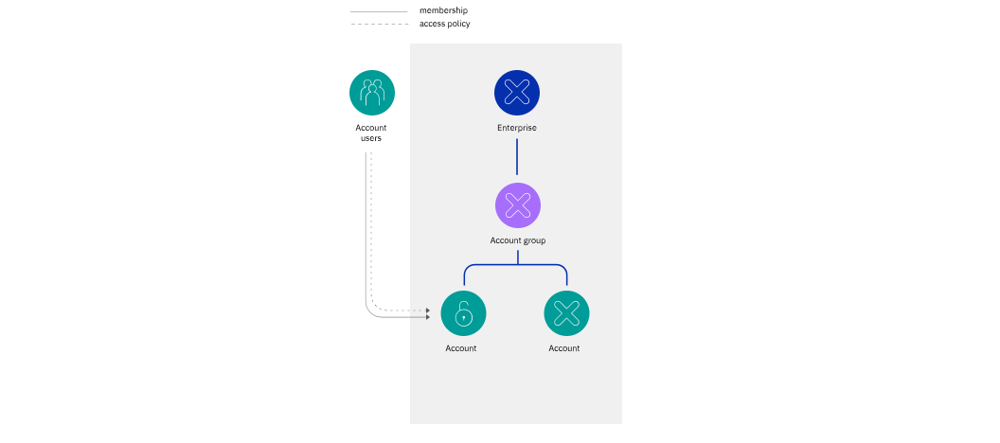

---

copyright:

  years: 2019

lastupdated: "2019-07-24"

keywords: enterprise policy, enterprise access, assign enterprise access, enterprise service

subcollection: iam

---

{:shortdesc: .shortdesc}
{:codeblock: .codeblock}
{:screen: .screen}
{:new_window: target="_blank"}
{:tip: .tip}
{:note: .note}
{:external: target="_blank" .external}

# Asignación de acceso de empresa
{: #assign-access-enterprise}

Para asignar a un usuario acceso para gestionar una empresa de {{site.data.keyword.Bluemix}}, debe invitarlo a la cuenta de empresa y asignarle un acceso al servicio de gestión de cuentas de empresa.
{:shortdesc}

El acceso para gestionar la [empresa](/docs/account?topic=account-enterprise) requiere una política de acceso dentro de la cuenta de empresa. Cuando asigna a un usuario una política de servicio de gestión de cuentas de empresa dentro de una cuenta secundaria en una empresa, el usuario no puede gestionar la empresa a la que pertenece la cuenta. Según el rol asignado al usuario en el servicio de gestión de cuentas de Empresa en la cuenta de la empresa, el usuario puede realizar acciones específicas:

* Crear nuevas cuentas en la empresa
* Crear y dar nombre a grupos de cuentas
* Mover cuentas de un grupo de cuentas a otro
* Importar cuentas existentes a la empresa
* Actualizar el nombre o el dominio de la empresa
* Ver informes de uso de la empresa, de un grupo de cuentas específico y de las cuentas o grupos de cuentas que contiene, o de una cuenta específica

Una política que otorgue a un usuario acceso al servicio de empresa se puede asignar para toda la empresa o sólo para una cuenta o un grupo de cuentas específico.
{: tip}

Por lo general, la propia cuenta de empresa no contiene muchos recursos. En su lugar, los recursos se crean en las cuentas secundarias de la empresa. Dentro de cada una de estas cuentas, se puede invitar a los usuarios y se les puede dar acceso para gestionar y trabajar con los recursos. El acceso y la pertenencia que un usuario tiene en la cuenta de empresa no se aplica a las cuentas y grupos de cuentas inferiores en la jerarquía de la empresa. La gestión de usuarios y la gestión de acceso permanece aislada en cada una de las cuentas, tal como se puede ver en los diagramas siguientes.

El primer diagrama muestra cómo se puede asignar a un usuario de la cuenta de empresa una política para gestionar toda la empresa o una política que se circunscribe a un grupo de cuentas, que proporciona acceso para gestionar sólo ese grupo de cuentas y las demás cuentas o grupos de cuentas inferiores dentro del mismo.


El destino y el rol de la política son importantes para determinar el alcance del acceso. Un usuario, un ID de servicio o un grupo de acceso en una empresa, que es el sujeto de la política, puede completar las tareas de gestión de empresa de toda la empresa, un grupo de cuentas que puede contener otras cuentas o grupos de cuentas, o incluso una sola cuenta. Por ejemplo, si asigna a un usuario de la cuenta de empresa una política de acceso sobre el servicio de gestión de cuentas de Empresa con un destino circunscrito a un grupo de cuentas específico, tiene acceso para completar tareas dentro del grupo de cuentas. El usuario no puede completar acciones que afecten a toda la empresa, como actualizar el nombre o el dominio de la empresa, cuando el destino definido es una cuenta o un grupo de cuentas específico.

Puede asignar a usuarios de una cuenta secundaria de la empresa políticas de acceso que se apliquen a la gestión sólo de esa cuenta o de los recursos que contiene. Si asigna un usuario de una cuenta secundaria un rol en el servicio de gestión de cuentas de Empresa, por ejemplo, el usuario no puede realizar acciones en el nivel de cuenta de empresa. Debe añadirlo en la cuenta de empresa y asignar la política en ese contexto.



## Políticas necesarias para trabajos específicos
{: #sample-enterprise-policies}

Según el trabajo que se debe realizar, es posible que se necesite una combinación de políticas de acceso para un usuario que no sea el propietario de la empresa. En los ejemplos siguientes se proporciona el conjunto de políticas de acceso que debe asignar a un usuario de la empresa para que pueda completar tareas concretas.

Si es propietario de una cuenta que no forma parte de una empresa, pero desea que otro usuario de su cuenta pueda convertir su cuenta en una empresa, puede asignar a ese usuario el rol de Administrador en el servicio de Gestión de cuentas de facturación.
{: note}

### Visualización del uso y gestión de la facturación en la empresa
{: #billing-admin-enterprise}

Para que un usuario pueda [ver los informes de uso](/docs/billing-usage?topic=billing-usage-enterprise-usage) de todas las cuentas de la empresa, realizar los pagos y visualizar las facturas, debe asignar todas las políticas de acceso siguientes:

* Rol de visor de informes de uso para el servicio de Gestión de cuentas de empresa en la cuenta de empresa
* Rol de Administrador para el servicio de Gestión de cuentas de facturación en la cuenta de empresa

### Importar una cuenta existente a la empresa
{: #add-account}

Para que un usuario pueda [importar una cuenta existente de IBM Cloud a la empresa](/docs/account?topic=account-enterprise-add#add-accounts), debe asignarle todas las siguientes políticas de acceso:

* Rol de administrador en el servicio de Gestión de cuentas de facturación de la cuenta que se va a importar
* Rol de Administrador o de Editor en el servicio de Gestión de cuentas de Empresa para el grupo de cuentas o la cuenta de empresa donde se añadirá la cuenta
* Rol de Administrador en el servicio de Gestión de cuentas de facturación para la cuenta de empresa

### Mover una cuenta
{: #move-accountgroup}

Para que un usuario pueda [mover una cuenta dentro de una empresa](/docs/account?topic=account-enterprise-organize#move-accounts), debe asignarle las siguientes políticas de acceso:

* Rol de Administrador para el servicio de Gestión de cuentas de facturación en la cuenta de empresa

Y después, una de las dos opciones siguientes:

* Rol de Administrador o de Editor para el servicio de Gestión de cuentas de empresa para toda la empresa
* Rol de Administrador o Editor en el grupo de cuentas actual y en el de destino al que se moverá esta cuenta

Para obtener detalles sobre las acciones que pueden realizar los usuarios para cada rol, consulte [Acciones y roles para los servicios de gestión de cuentas](/docs/iam?topic=iam-account-services#account-management-actions-roles).

## Asignación del acceso en la consola
{: #enterprise-access-console}

Para asignar una política de acceso a un usuario existente en la cuenta de empresa, realice los pasos siguientes:

Puede establecer el destino de la política de forma que sea para toda la empresa, para un grupo de cuentas específico, que puede incluir el acceso a todas las cuentas dentro del mismo, o incluso para una cuenta específica dentro de un grupo de cuentas.
{: tip}

1. En la barra de menús, pulse **Gestionar** &gt; **Acceso (IAM)** y seleccione **Usuarios**.
2. En la fila correspondiente al usuario al que desea asignar acceso, seleccione el menú **Acciones**  y pulse **Asignar acceso**.
3. Seleccione que desea asignar acceso a **Servicios de gestión de cuentas**.
4. Seleccione **Empresa** como el servicio.
5. Opcional: Establezca el ámbito de la política a toda la empresa, un grupo de cuentas o una cuenta.
6. Seleccione cualquier combinación de roles para asignar el acceso deseado.

| Roles | Acciones |
|:-------|----------|
| Visor |  Ver la empresa, los grupos de cuentas y las cuentas    |
| Operador |  Ver la empresa, los grupos de cuentas y las cuentas    |
| Editor |  Ver y actualizar la empresa, editando el nombre y el dominio, crear cuentas y grupos de cuentas, ver informes de uso e importar cuentas |
| Administrador |  Ver y actualizar la empresa, editando el nombre y el dominio, crear cuentas y grupos de cuentas, mover cuentas de un grupo de cuentas a otro, importar cuentas existentes y ver informes de uso  |
| Visor de informes de uso | Ver la empresa, las cuentas y grupos de cuentas y ver los informes de uso de todas las cuentas de la empresa |
{: caption="Tabla 1. Roles y acciones de ejemplo para el servicio de Gestión de cuentas de empresa" caption-side="top"}

## Asignación de acceso utilizando la CLI
{: #enterprise-cli-policy}

Para crear una nueva política de acceso para un usuario, ejecute el mandato **`ibmcloud iam user-policy-create`**. En el mandato de ejemplo se utiliza un archivo JSON para especificar los detalles de la política. Revise el ejemplo de la sección [Asignación de acceso utilizando la API](#enterprise-api-policy) para ver un ejemplo de qué incluir en el archivo JSON.

Cree una política de usuario:
```
$ ibmcloud iam user-policy-create name@example.com -f policy.json
```

Para obtener más información, consulte [ibmcloud iam user-policy-create](/docs/cli/reference/ibmcloud?topic=cloud-cli-ibmcloud_commands_iam#ibmcloud_iam_user_policy_create).

## Asignación de acceso utilizando la API
{: #enterprise-api-policy}

En la siguiente solicitud de ejemplo se asigna una política a un usuario con el rol de Editor sobre el servicio de Empresa en una cuenta de empresa delimitando el ámbito a un grupo de cuentas. Este tipo de política es jerárquico y se aplica a todos los objetos descendientes de la jerarquía, es decir, a todas las cuentas o grupos de cuentas dentro del grupo de cuentas de destino especificado.  

```
curl -X POST \
'https://iam.cloud.ibm.com/v1/policies' \
-H 'Authorization: $TOKEN' \
-H 'Content-Type: application/json' \
-d '{
  "type": "access",
  "subjects": [
    {
      "attributes": [
        {
          "name": "iam_id",
          "value": "<IBMid-example>"
        }
      ]
    }
  ],
  "roles":[
    {
      "role_id": "crn:v1:bluemix:public:iam::::role:Editor"
    }
  ],
  "resources":[
    {
      "attributes": [
        {
          "name": "accountId",
          "value": "<account-id-example>"
        },
        {
          "name": "serviceName",
          "value": "enterprise"
        },
        {
          "name": "accountGroupId",
          "value": "<accountGroupId-example>"
        }
      ]
    }
  ]
}'
```
{: codeblock}

Para obtener más información, consulte [Crear una política](https://cloud.ibm.com/apidocs/iam-policy-management#create-a-policy){: external}.
