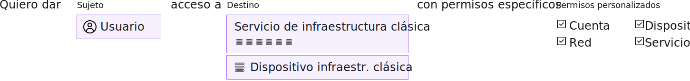

---

copyright:

  years: 2017, 2019

lastupdated: "2019-05-14"

keywords: SoftLayer permissions, classic infrastructure access, classic infrastructure permission, migrated SoftLayer permissions, migrated permission access group

subcollection: iam

---

{:shortdesc: .shortdesc}
{:codeblock: .codeblock}
{:screen: .screen}
{:important: .important}
{:new_window: target="_blank"}

# Permisos de la infraestructura clásica
{: #infrapermission}

Cuando invita a un usuario a su cuenta, puede seleccionar entre tres conjuntos de permisos de la infraestructura clásica que asignan acceso masivo: Solo vista, Usuario básico, Superusuario.
{:shortdesc}

Cuando invita a alguien a la cuenta, solo usted, el propietario de la cuenta o un usuario con el permiso de la infraestructura clásica Gestionar usuario pueden ajustar los permisos del usuario. Si no es el propietario de la cuenta, solo puede asignar el nivel de permisos o un subconjunto de permisos que ya tenga asignados. Un propietario de cuenta puede actualizar los permisos de otros usuarios de la cuenta para que puedan tener cualquier nivel de acceso.

Se pueden establecer permisos adicionales después de que el usuario haya aceptado la invitación. Por ejemplo, el conjunto inicial de permisos asignado en la invitación no otorga acceso a dispositivos. Por lo tanto, debe otorgar acceso a dispositivos después de que el usuario haya aceptado la invitación. Para obtener más información, consulte [Gestión de acceso de la infraestructura clásica](/docs/iam?topic=iam-mngclassicinfra#mngclassicinfra).

En el siguiente gráfico se muestra cómo se asignan los permisos de infraestructura clásica por usuario. Puede otorgar a cada usuario acceso a un dispositivo o servicio de infraestructura clásica seleccionando entre las opciones de permiso granular para personalizar cada acceso de usuario.

## Permisos migrados de la infraestructura clásica
{: #predefined}

Un conjunto de permisos de la infraestructura clásica para ver y gestionar información de facturación y para trabajar con casos de soporte se migran a grupos de acceso. A los usuarios de su cuenta a los que se asignó anteriormente estos permisos ahora se les asignará el grupo de acceso de permisos migrados correspondiente. Como resultado, los permisos de la infraestructura clásica se pueden gestionar directamente mediante políticas de acceso de IAM. Para obtener más información sobre los permisos migrados y los grupos de acceso utilizados para cada uno, consulte [Gestión de permisos migrados de cuenta de SoftLayer](/docs/iam?topic=iam-migrated_permissions).
