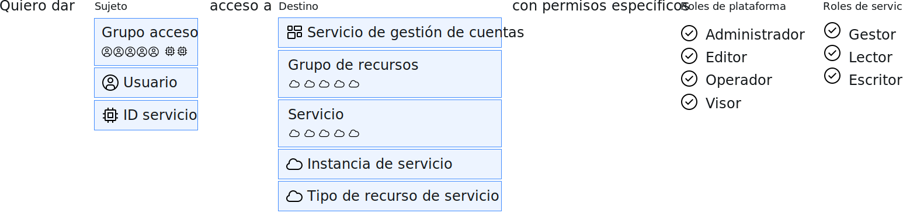

---

copyright:

  years: 2015, 2019

lastupdated: "2019-06-04"

keywords: IAM access, access policy, IAM roles, platform management roles, service access roles, types of access policies

subcollection: iam

---

{:shortdesc: .shortdesc}
{:codeblock: .codeblock}
{:screen: .screen}
{:tip: .tip}
{:note: .note}
{:new_window: target="_blank"}

# Acceso de IAM
{: #userroles}

Todos los servicios que están organizados en un grupo de recursos en su cuenta se gestionan utilizando {{site.data.keyword.Bluemix_notm}} Identity and Access Management (IAM). A los propietarios de las cuentas se les asigna automáticamente el rol de administrador de la cuenta para Cloud IAM. Como administrador de la cuenta, puede asignar y gestionar el acceso para los usuarios, crear grupos de recursos, crear grupos de acceso, ver detalles de facturación y realizar un seguimiento del uso, y crear instancias de servicio. Puede proporcionar acceso a usuarios, a ID de servicio y a grupos de acceso mediante la creación de políticas que establezcan un destino para el sujeto de la política de acceso y un rol que defina el tipo de acceso permitido.
{: shortdesc}

## ¿Qué son las políticas de Cloud IAM y quien las puede asignar?
{: #iamusermanpol}

Una política concede a un sujeto uno o varios roles sobre un conjunto de recursos para que se puedan realizar determinadas acciones en el contexto de los recursos de destino especificados.

El siguiente gráfico ayuda a explicar cómo se crea la política de IAM. Las políticas siempre se crean especificando primero el sujeto. El sujeto es un usuario específico, un ID de servicio o un grupo de acceso. A continuación, se selecciona el destino de la política, que es a lo que está permitiendo al usuario acceder, por ejemplo: todos los servicios de un grupo de recursos, todos los servicios habilitados por IAM en la cuenta, los servicios de gestión de cuenta o una instancia de servicio determinada. Finalmente, completa su política de acceso seleccionando entre los roles disponibles. Estos roles definen exactamente qué acciones puede completar un usuario. En función del servicio que seleccione, podría haber disponibles opciones de configuración adicionales.

Puede asignar y gestionar políticas si tiene el rol adecuado. En la tabla siguiente se muestran las tareas de gestión de políticas y el rol necesario para cada una de ellos.

| Acción | Rol necesario |
|----------|---------|
| Crear una política en una cuenta para todos los servicios e instancias | Propietario o administrador de la cuenta en todos los servicios de gestión de cuentas y en los servicios habilitados para Identity and Access |
| Crear una política en un servicio de una cuenta | Propietario de la cuenta, administrador en todos los servicios habilitados para Identity and Access o administrador en el servicio de la cuenta |
| Crear una política en una instancia de servicio | Propietario de la cuenta, administrador en todos los servicios habilitados para Identity and Access, administrador en el servicio en la cuenta, administrador en todos los servicios del grupo de recursos relevante o administrador en la instancia de servicio |
{: caption="Tabla 1. Usuarios que pueden crear políticas de acceso" caption-side="top"}

## Tipos de política de acceso común
{: #policytypes}

Puede proporcionar un acceso detallado para usuarios, ID de servicio o grupos de acceso mediante la asignación de los tipos siguientes de políticas de acceso:

* Todos los servicios de gestión de cuentas
* Servicio de gestión de cuentas específico
* Todos los recursos en la cuenta
* Todos los recursos en todos los servicios que pertenecen a un grupo de recursos individual con la capacidad de gestionar el grupo de recursos
* Todos los recursos en un único servicio en un grupo de recursos con la capacidad de gestionar el grupo de recursos
* Todos los recursos en un único servicio en toda la cuenta, independientemente del grupo de recursos al que estén asignados
* Recursos en una instancia individual
* Un único tipo de recurso en una instancia, por ejemplo, un grupo en una instancia de {{site.data.keyword.objectstorageshort}}

Para otorgar acceso completo a la cuenta a otro usuario con el fin de gestionar accesos de usuario y gestionar todos los recursos de la cuenta, debe asignar dos políticas. Una política que otorgue acceso al usuario a todos los recursos de la cuenta seleccionando **Todos los servicios habilitados de Identity and Access** con el rol de **Administrador** y **Gestor** asignado. Y una política que otorgue acceso al usuario a todos los recursos de gestión de cuentas de la cuenta seleccionando **Todos los servicios de gestión de cuentas** con el rol de **Administrador** asignado.
{: tip}

## Roles de Cloud IAM
{: #iamusermanrol}

Con Cloud IAM, puede gestionar y definir el acceso para usuarios y recursos en su cuenta. Se pueden asignar dos tipos de roles: roles de gestión de plataforma y roles de acceso al servicio.

<dl>
<dt>Roles de gestión de plataforma</dt>
<dd>Los roles de gestión de plataforma cubren un rango de acciones, que incluyen la capacidad de crear y suprimir instancias, gestionar alias, enlaces y credenciales y gestionar el acceso. Los roles de plataforma son: administrador, editor, operador y visor. Los roles de gestión de plataforma también se aplican a los [servicios de gestión de cuentas](/docs/iam?topic=iam-account-services#account-services) que permiten a los usuarios invitar a usuarios, gestionar ID de servicio, acceder a políticas, catalogar entradas y realizar un seguimiento de la facturación y del uso, en función de su rol asignado en un servicio de gestión de cuentas.</dd>
<dt>Roles de acceso al servicio</dt>
<dd>Los roles de acceso al servicio definen la capacidad de un usuario o servicio de realizar acciones en una instancia de servicio, como acceder a la consola o realizar llamadas de API. Los roles de acceso al servicio son el gestor, escritor y lector. </dd>
</dl>

Puede que no vea todos los roles mostrados en esta lista como opciones cuando asigna políticas en la IU porque solo se muestran los roles disponibles para el servicio que ha seleccionado. Para obtener información específica sobre qué roles están habilitados y qué acciones permite cada rol de acceso para cada servicio, consulte la documentación para dicho servicio.
{: note}

### Roles de gestión de plataforma
{: #platformroles}

Con roles de gestión de plataforma, se puede asignar a los usuarios distintos niveles de permiso para realizar acciones de plataforma en la cuenta y en un servicio. Por ejemplo, los roles de gestión de plataforma que se asignan para los recursos de catálogo permiten a los usuarios realizar acciones como crear, suprimir, editar y ver instancias de servicio. Además, los roles de gestión de plataforma que se asignan para los servicios de gestión de cuentas permiten a los usuarios realizar acciones tales como invitar y eliminar usuarios, trabajar con grupos de recursos y ver información de facturación. Para obtener más información sobre los servicios de gestión de cuentas, consulte [Asignación de acceso a los servicios de gestión de cuentas](/docs/iam?topic=iam-account-services#account-services).

Seleccione todos los roles que se aplican al crear una política. Cada rol permite completar acciones separadas y no hereda las acciones de los roles inferiores.
{: tip}

En la siguiente tabla encontrará ejemplos de algunas de acciones de gestión de plataforma que los usuarios pueden realizar dentro del contexto de recursos de catálogo y grupos de recursos. Consulte la documentación de cada oferta del catálogo para saber cómo se aplican los roles a los usuarios en el contexto del servicio que está utilizando.

|  | Uno o todos los servicios habilitados de IAM | Servicio seleccionado en un grupo de recursos | Grupo de recursos seleccionado |
|:--------------|:------------|:-------------|:-------------|
| Rol Visor | Ver instancias, alias, enlaces y credenciales | Ver solo instancias especificadas en el grupo de recursos | Ver grupo de recursos |
| Rol Operador |  Ver instancias y gestionar alias, enlaces y credenciales |  No aplicable | No aplicable |
| Rol Editor |  Crear, suprimir, editar y ver instancias. Gestionar alias, enlaces y credenciales | Crear, suprimir, editar, suspender, reanudar, ver y enlazar solo instancias especificadas en el grupo de recursos | Ver y editar el nombre de grupo de recursos |
| Rol Administrador |  Todas las acciones de gestión para los servicios | Todas las acciones de gestión para las instancias especificadas en el grupo de recursos | Ver, editar y gestionar el acceso para el grupo de recursos |
{: row-headers}
{: class="comparison-table"}
{: caption="Tabla 2. Roles y acciones de gestión de plataforma de ejemplo para servicios de una cuenta" caption-side="top"}
{: summary="The first row of the table describes separate options that you can choose from when creating a policy, and the first column describes the selected roles for the policy. The remaining cells map to which role is selected from the first column, and which type of policy has been selected from the options in the first row."}
{: #platformrolestable1}

Para obtener información sobre las acciones específicas que pueden emprender los usuarios según su rol asignado sobre los servicios de gestión de cuentas, consulte [Asignación de acceso a los servicios de gestión de cuentas](/docs/iam?topic=iam-account-services).
{: #acctmgmt}

Algunos servicios pueden correlacionar acciones específicas con los roles de gestión de plataforma que están relacionados con la gestión del servicio en lugar de con el acceso al servicio. Como ejemplo, consulte en la tabla siguiente los detalles de las acciones del servicio {{site.data.keyword.containershort_notm}} que están correlacionadas con dichos roles.

| Rol de gestión de plataforma | Acciones | Acciones de ejemplo para {{site.data.keyword.containershort_notm}} |
|:-----------------|:-----------------|:-----------------|
| Visor | Puede ver las instancias de servicio, pero no las puede modificar  | <ul><li>Listar clústeres</li><li>Ver los detalles de un clúster</li></ul>|
| Editor | Realizar todas las acciones de plataforma excepto la gestión de la cuenta y la asignación de políticas de acceso |<ul><li>Enlazar un servicio a un clúster</li><li>Crear un webhook</li></ul> |
| Operador | Realizar acciones de plataforma necesarias para configurar y operar instancias de servicio, como la visualización de un panel de control de servicio | <ul><li>Añadir o eliminar nodos trabajadores</li><li>Reiniciar o recargar nodos trabajadores</li><li>Enlazar un servicio a un clúster</li></ul> |
| Administrador | Realizar todas las acciones de plataforma basadas en el recurso al que se está asignando este rol, incluida la asignación de políticas de acceso a otros usuarios |<ul><li>Eliminar un clúster</li><li>Crear un clúster</li><li>Actualizar políticas de acceso de usuarios</li><li>Todas las acciones que puede realizar un visor, un editor, y un operador</li></ul>|
{: caption="Tabla 3. Roles y acciones de gestión de plataforma de ejemplo para el servicio de {{site.data.keyword.containershort_notm}}" caption-side="top"}

### Roles de acceso al servicio
{: #service_access_roles}

Los roles de acceso al servicio permiten asignar a los usuarios diferentes niveles de permiso para llamar a la API del servicio y acceder a la IU para el servicio. La tabla siguiente proporciona acciones de ejemplo que se pueden realizar en los roles asignados en función del uso del servicio {{site.data.keyword.objectstorageshort}}.

Las acciones que se pueden llevar a cabo en cada rol asignado varían en función de servicio seleccionado para la política. No todos los servicios utilizan estos tipos de roles. Consulte la documentación del servicio para obtener más detalles.
{: note}

| Rol de acceso al servicio | Acciones | Acciones de ejemplo para el servicio {{site.data.keyword.objectstorageshort}} |
|:-----------------|:-----------------|:-----------------|
|  Lector | Realizar acciones de solo lectura dentro de un servicio, como la visualización de recursos específicos del servicio | Listar y descargar objetos |
| Escritor | Permisos que van más allá del rol de lector, incluida la creación y la edición de recursos específicos del servicio | Crear y destruir grupos y objetos |
| Gestor | Permisos que van más allá del rol de escritor para completar las acciones privilegiadas tal como define el servicio, y además crear y editar recursos específicos del servicio | Gestionar todos los aspectos del almacenamiento de datos, crear y destruir grupos y objetos |
{: caption="Tabla 4. Roles y acciones de usuario de acceso de servicio de ejemplo" caption-side="top"}
