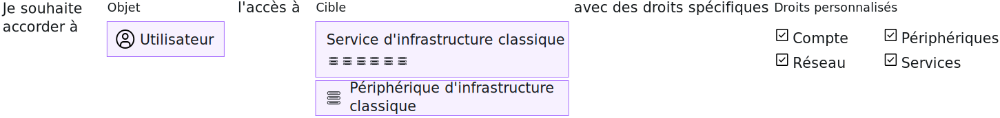

---

copyright:

  years: 2017, 2019

lastupdated: "2019-05-14"

keywords: SoftLayer permissions, classic infrastructure access, classic infrastructure permission, migrated SoftLayer permissions, migrated permission access group

subcollection: iam

---

{:shortdesc: .shortdesc}
{:codeblock: .codeblock}
{:screen: .screen}
{:important: .important}
{:new_window: target="_blank"}

# Droits d'infrastructure classique
{: #infrapermission}

Lorsque vous invitez un utilisateur à rejoindre votre compte, vous pouvez effectuer un choix parmi les trois ensembles de droits d'infrastructure classique qui affectent un accès en bloc : Affichage uniquement, Utilisateur de base, Superutilisateur.
{:shortdesc}

Lorsque vous invitez une personne à rejoindre le compte, seul vous, le propriétaire du compte ou un utilisateur disposant du droit Gestion de l'infrastructure classique d'utilisateur, pouvez adapter les droits pour l'utilisateur. Si vous affectez des droits et que vous n'êtes pas le propriétaire du compte, vous pouvez affecter uniquement le niveau de droits ou un sous-ensemble de droits dont vous disposez. Un propriétaire de compte peut mettre à jour les droits de n'importe quel utilisateur du compte afin de lui accorder le niveau d'accès souhaité.

Vous pouvez définir des droits supplémentaires une fois que l'utilisateur a accepté l'invitation. Par exemple, l'ensemble de droits initiaux accordé lors de l'invitation ne donne pas accès aux périphériques. Par conséquent, vous devez octroyer l'accès aux périphériques une fois que l'utilisateur a accepté l'invitation. Pour plus d'informations, voir [Gestion de l'accès à l'infrastructure classique](/docs/iam?topic=iam-mngclassicinfra#mngclassicinfra).

Le graphique suivant présente comment les droits d'infrastructure classique sont affectés par utilisateur. Vous pouvez accorder à chaque utilisateur l'accès à un périphérique ou à un service d'infrastructure classique en effectuant une sélection parmi les options de droits granulaires afin de personnaliser l'accès de chaque utilisateur.

## Droits d'infrastructure classique migrés
{: #predefined}

Un ensemble de droits d'infrastructure classique pour l'affichage et la gestion des informations de facturation et l'utilisation des cas de support est désormais migré vers des groupes d'accès. Les utilisateurs de votre compte auxquels ces droits ont été précédemment affectés sont désormais affectés au groupe d'accès des droits migrés respectifs. Par conséquent, les droits d'infrastructure classique peuvent être directement gérés en utilisant des règles d'accès IAM. Pour plus d'informations sur les droits migrés et les groupes d'accès utilisés pour chacun d'eux, voir [Gestion des droits de compte SoftLayer migrés](/docs/iam?topic=iam-migrated_permissions).
