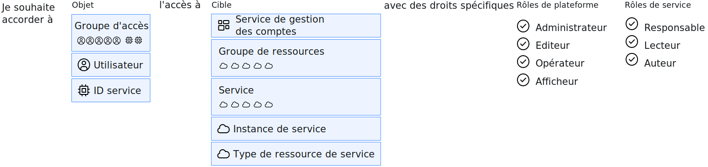

---

copyright:

  years: 2015, 2019

lastupdated: "2019-06-04"

keywords: IAM access, access policy, IAM roles, platform management roles, service access roles, types of access policies

subcollection: iam

---

{:shortdesc: .shortdesc}
{:codeblock: .codeblock}
{:screen: .screen}
{:tip: .tip}
{:note: .note}
{:new_window: target="_blank"}

# Accès IAM
{: #userroles}

Tous les services organisés en un groupe de ressources dans votre compte sont gérés via {{site.data.keyword.Bluemix_notm}} Identity and Access Management (IAM). Le rôle d'administrateur des accès au compte pour le service Cloud IAM est automatiquement affecté aux propriétaires de compte. En tant qu'administrateur de compte, vous pouvez affecter et gérer l'accès des utilisateurs, créer des groupes de ressources, créer des groupes d'accès, afficher les informations de facturation et de suivi, et créer des instances de service. Vous accordez l'accès aux utilisateurs, aux ID de service et aux groupes d'accès en créant des règles qui définissent une cible pour l'accès de l'objet de la règle et un rôle qui définit le type d'accès autorisé.
{: shortdesc}

## Quelles sont les règles Cloud IAM et qui peut les affecter ?
{: #iamusermanpol}

Une règle accorde à un objet un ou plusieurs rôles sur un ensemble de ressources de sorte que des actions spécifiques puissent être engagées dans le contexte des ressources cible spécifiées.

Le graphique suivant présente comment la règle IAM est créée. Les règles sont toujours créées en spécifiant l'objet en premier. L'objet est un utilisateur spécifique, un ID de service ou un groupe d'accès. Ensuite, la cible de la règle est sélectionnée. Il s'agit des éléments auxquels l'utilisateur est autorisé à accéder, comme tous les services d'un groupe de ressources, tous les services activés par IAM dans le compte, les services de gestion des comptes ou une instance de service spécifique. Pour finir, terminez votre règle d'accès en effectuant une sélection parmi les rôles disponibles. Ces rôles définissent les actions pouvant être effectuées par un utilisateur. D'autres options de configuration peuvent être disponibles, selon le service que vous sélectionnez.

Vous pouvez affecter et gérer des règles si le rôle approprié vous a été attribué. Le tableau suivant décrit les tâches de gestion des règles et le rôle requis pour chacune.

| Action | Rôle requis |
|----------|---------|
| Créer une règle dans un compte pour tous les services et instances | Propriétaire de compte ou administrateur de tous les services de gestion de compte et de tous les services activés pour IAM |
| Créer une règle sur un service dans un compte | Propriétaire du compte, administrateur de tous les services activés pour IAM, ou administrateur du service dans le compte |
| Créer une règle sur une instance de service | Propriétaire du compte, administrateur de tous les services activés pour IAM, ou administrateur du service dans le compte, administrateur de tous les services dans le groupe de ressources pertinent, ou administrateur de l'instance de service |
{: caption="Tableau 1. Utilisateurs autorisés à créer des règles d'accès" caption-side="top"}

## Types de règles d'accès courantes
{: #policytypes}

Vous pouvez attribuer un accès à granularité fine aux utilisateurs, aux ID de service ou aux groupes d'accès en affectant les types de règles d'accès suivants :

* Tous les services de gestion des comptes
* Service de gestion de compte spécifique
* Toutes les ressources d'un compte
* Toutes les ressource de tous les services appartenant à un groupe de ressources spécifique avec la possibilité de gérer le groupe de ressources
* Toutes les ressources d'un seul service dans un groupe de ressources avec la possibilité de gérer le groupe de ressources
* Toutes les ressources d'un seul service du compte, quel que soit le groupe de ressources auquel elles sont affectées
* Les ressources d'une instance individuelle
* Un seul type de ressource dans une instance, par exemple, un compartiment dans une instance {{site.data.keyword.objectstorageshort}}

Pour accorder à un autre utilisateur l'accès complet au compte à des fins de gestion des accès utilisateur et de gestion de toutes les ressources de compte, vous devez affecter deux règles. La première octroie à l'utilisateur l'accès à toutes les ressources en sélectionnant **Tous les services avec l'offre Identity and Access activée** avec les rôles **Administrateur** et **Responsable** affectés. L'autre règle octroie à l'utilisateur l'accès à tous les services de gestion des comptes du compte en sélectionnant **Tous les services de gestion des comptes** avec le rôle **Administrateur** affecté.
{: tip}

## Rôles Cloud IAM
{: #iamusermanrol}

Cloud IAM vous permet de gérer et de définir les droits d'accès des utilisateurs et des ressources dans votre compte. Types de rôles pouvant être affectés : rôles de gestion de la plateforme et rôles d'accès aux services.

<dl>
<dt>Rôles de gestion de plateforme</dt>
<dd>Les rôles de gestion de plateforme couvrent une gamme d'actions, notamment la possibilité de créer et de supprimer des instances, de gérer des alias, des liaisons, des données d'identification et de gérer les accès. Les rôles de plateforme sont les suivants : administrateur, éditeur, opérateur, afficheur. Les rôles de gestion de plateforme s'appliquent également aux [services de gestion de compte](/docs/iam?topic=iam-account-services#account-services) qui permettent aux utilisateurs d'inviter des utilisateurs, de gérer les ID de service, les règles d'accès, les entrées de catalogue et d'effectuer le suivi de la facturation et de l'utilisation en fonction du rôle qui leur est affecté dans un compte de gestion de service.</dd>
<dt>Rôles Accès au service</dt>
<dd>Les rôles d'accès au service définissent la capacité qu'a un utilisateur ou un service d'exécuter des actions sur une instance de service, par exemple, accéder à la console ou effectuer des appels API. Les rôles d'accès au service sont les suivants : responsable, auteur et lecteur. </dd>
</dl>

Tous les rôles listés ici ne seront pas forcément affichés lorsque vous affectez des règles dans l'interface utilisateur vu que seuls sont affichés les rôles disponibles pour le service choisi. Pour plus d'informations sur les rôles qui sont activés et sur les actions que chaque rôle d'accès autorise pour chaque service, reportez-vous à la documentation du service concerné.
{: note}

### Rôles de gestion de plateforme
{: #platformroles}

Les rôles de gestion de plateforme permettent d'attribuer aux utilisateurs des degrés d'autorisation différents pour effectuer des actions de plateforme dans le compte et sur un service. Par exemple, les rôles de gestion de plateforme affectés pour les ressources de catalogue permettent aux utilisateurs d'effectuer des actions comme la création, la suppression, l'édition et l'affichage d'instances de service. Les services de gestion de plateforme affectés pour les services de gestion de service permettent aux utilisateurs d'effectuer des actions comme l'invitation et la suppression d'utilisateurs, l'utilisation de groupes de ressources et l'affichage des informations de facturation. Pour plus d'informations sur les services de gestion de compte, voir [Affectation de l'accès aux services de gestion de compte](/docs/iam?topic=iam-account-services#account-services).

Sélectionnez tous les rôles qui s'appliquent lors de la création d'une règle. Chaque rôle permet d'effectuer des actions séparées et n'hérite pas des actions des rôles inférieurs.
{: tip}

Les tableaux ci-après fournissent des exemples de certaines actions de gestion de plateforme que les utilisateurs peuvent effectuer dans le contexte de ressources de catalogue et de groupes de ressources. Pour comprendre comment les rôles s'appliquent aux utilisateurs dans le contexte du service que vous utilisez, reportez-vous à la documentation pour chaque offre de catalogue.

|  | Un ou tous les services activés pour IAM | Service sélectionné dans un groupe de ressources | Groupe de ressources sélectionné |
|:--------------|:------------|:-------------|:-------------|
| Rôle Afficheur | Afficher des instances, des alias, des liaisons et des données d'identification | Afficher uniquement des instances spécifiées du groupe de ressources | Afficher un groupe de ressources |
| Rôle Opérateur |  Afficher des instances et gérer des alias, des liaisons et des données d'identification |  Non applicable | Non applicable |
| Rôle Editeur |  Créer, supprimer, éditer et afficher des instances. Gérer des alias, des liaisons et des données d'identification | Créer, supprimer, éditer, suspendre, reprendre, afficher et lier uniquement des instances spécifiées du groupe de ressources | Afficher et éditer le nom d'un groupe de ressources |
| Rôle Administrateur |  Toutes les actions de gestion pour des services | Toutes les actions de gestion pour des instances spécifiées du groupe de ressources | Afficher, éditer et gérer l'accès pour le groupe de ressources |
{: row-headers}
{: class="comparison-table"}
{: caption="Tableau 2. Exemples de rôles et d'actions de gestion de plateforme pour les services dans un compte" caption-side="top"}
{: summary="The first row of the table describes separate options that you can choose from when creating a policy, and the first column describes the selected roles for the policy. The remaining cells map to which role is selected from the first column, and which type of policy has been selected from the options in the first row."}
{: #platformrolestable1}

Pour plus d'informations sur les actions spécifiques que les utilisateurs peuvent effectuer en fonction du rôle qui leur a été affecté sur les services de gestion de compte, voir [Affectation de l'accès aux services de gestion de compte](/docs/iam?topic=iam-account-services).
{: #acctmgmt}

Certains services peuvent mapper des actions spécifiques aux rôles de gestion de plateforme qui sont liés à la gestion du service plutôt qu'à l'accès du service. A titre d'exemple, reportez-vous au tableau suivant dans lequel sont décrites les actions de service {{site.data.keyword.containershort_notm}} mappées à ces rôles.

| Rôles de gestion de plateforme | Actions | Exemples d'action pour {{site.data.keyword.containershort_notm}} |
|:-----------------|:-----------------|:-----------------|
| Afficheur | Afficher des instances de service, sans pouvoir les modifier  | <ul><li>Répertorier les clusters</li><li>Afficher les détails d'un cluster</li></ul>|
| Editeur | Effectuer toutes les actions de plateforme à l'exception de la gestion du compte et de l'affectation de règles d'accès |<ul><li>Lier un service à un cluster</li><li>Créer un webhook</li></ul> |
| Opérateur | Effectuer les actions de plateforme requises pour configurer et exploiter des instances de service, par exemple, l'affichage de tableau de bord d'un service. | <ul><li>Ajouter ou retirer des noeuds d'agent</li><li>Redémarrer ou recharger des noeuds worker</li><li>Lier un service à un cluster</li></ul> |
| Administrateur | Effectuer toutes les actions de plateforme en fonction de la ressource pour laquelle ce rôle est affecté, y compris l'affectation de règles d'accès à d'autres utilisateurs. |<ul><li>Retirer un cluster</li><li>Créer un cluster</li><li>Mise à jour des règles d'accès utilisateur</li><li>Toutes les actions qu'un afficheur, un éditeur et un opérateur peuvent effectuer</li></ul>|
{: caption="Tableau 3. Exemple d'actions et de rôles de gestion de plateforme pour le service {{site.data.keyword.containershort_notm}}" caption-side="top"}

### Rôles Accès au service
{: #service_access_roles}

Les rôles Accès au service permettent aux utilisateurs de se voir affecter différents niveaux de droits pour appeler l'API du service et accéder à l'interface utilisateur du service. Le tableau ci-après présente des exemples d'actions qui peuvent être exécutées en fonction des rôles affectés lors de l'utilisation du service {{site.data.keyword.objectstorageshort}}.

Les actions qui peuvent être exécutées en fonction de chaque rôle affecté varient selon le service que vous avez sélectionné pour la règle. Les services n'utilisent pas tous ces types de rôle. Pour plus d'informations, voir la documentation du service.
{: note}

| Rôle Accès au service | Actions | Exemples d'action pour {{site.data.keyword.objectstorageshort}} Service |
|:-----------------|:-----------------|:-----------------|
|  Lecteur | Effectuer des actions en lecture seule dans un service, par exemple, afficher les ressources spécifiques d'un service. | Répertorier et télécharger des objets |
| Auteur | Droits en plus du rôle de lecteur, notamment, créer et éditer des ressources pour un service. | Créer et détruire des compartiments et des objets |
| Responsable | Droits en plus du rôle d'auteur pour effectuer des actions privilégiées définies par le service, plus créer et éditer des ressources spécifiques des services. | Gérer tous les aspects de stockage de données. Créer et détruire des compartiments et des objets. |
{: caption="Tableau 4. Exemples d'actions et de rôles utilisateur d'accès au service" caption-side="top"}
