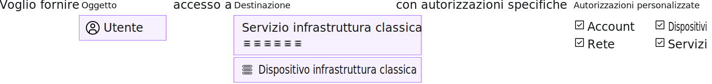

---

copyright:

  years: 2017, 2019

lastupdated: "2019-05-14"

keywords: SoftLayer permissions, classic infrastructure access, classic infrastructure permission, migrated SoftLayer permissions, migrated permission access group

subcollection: iam

---

{:shortdesc: .shortdesc}
{:codeblock: .codeblock}
{:screen: .screen}
{:important: .important}
{:new_window: target="_blank"}

# Autorizzazioni dell'infrastruttura classica
{: #infrapermission}

Quando inviti un utente al tuo account, puoi scegliere tra tre serie di autorizzazioni dell'infrastruttura classica che assegnano l'accesso in blocco: Solo visualizzazione, Utente di base e Super utente.
{:shortdesc}

Quando inviti qualcuno all'account, solo tu in qualità di proprietario dell'account o utente con l'autorizzazione di gestione utenti dell'infrastruttura classica, puoi modificare le autorizzazioni per un utente. Se non sei il proprietario dell'account, puoi assegnare solo il livello di autorizzazioni o un sottoinsieme dell'autorizzazione che ti è già stato assegnato. Un proprietario dell'account può aggiornare le autorizzazioni di chiunque nell'account per avere qualsiasi livello di accesso.

È possibile impostare autorizzazioni aggiuntive dopo che l'utente ha accettato l'invito. Ad esempio, la serie di autorizzazioni iniziale assegnata al momento dell'invito non concede l'accesso ai dispositivi. Devi pertanto concedere l'accesso ai dispositivi dopo che l'utente accetta l'invito. Per ulteriori informazioni, vedi [Gestione dell'accesso all'infrastruttura classica](/docs/iam?topic=iam-mngclassicinfra#mngclassicinfra).

Il seguente grafico mostra come le autorizzazioni dell'infrastruttura classica vengono assegnate per utente. Puoi concedere ad ogni utente l'accesso a un servizio o dispositivo dell'infrastruttura classica effettuando una selezione dalle opzioni di autorizzazione più dettagliate per personalizzare l'accesso di ogni utente.

## Autorizzazioni dell'infrastruttura classica migrate
{: #predefined}

Una serie di autorizzazioni dell'infrastruttura classica per visualizzare e gestire le informazioni di fatturazione e lavorare con i casi di supporto vengono ora migrate ai gruppi di accesso. Agli utenti del tuo account a cui sono state precedentemente assegnate queste autorizzazioni viene ora assegnato il rispettivo gruppo di accesso delle autorizzazioni migrate. Di conseguenza, le autorizzazioni dell'infrastruttura classica possono essere gestite direttamente utilizzando le politiche di accesso IAM. Per ulteriori informazioni sulle autorizzazioni migrate e sui gruppi di accesso utilizzati per ciascuna di esse, vedi [Gestione delle autorizzazioni dell'account SoftLayer migrate](/docs/iam?topic=iam-migrated_permissions).
