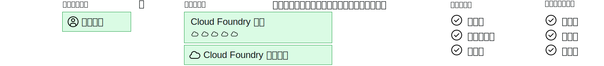

---

copyright:

  years: 2017, 2019

lastupdated: "2019-04-02"

keywords: Cloud Foundry roles, Cloud Foundry access, auditor, manager, developer, billing manager

subcollection: iam

---

{:shortdesc: .shortdesc}
{:codeblock: .codeblock}
{:screen: .screen}
{:new_window: target="_blank"}
{:tip: .tip}
{:note: .note}

# Cloud Foundry アクセス権限
{: #cfaccess}

現在、Cloud IAM を使用してすべてのサービスを管理できるわけではありません。 これらのサービス・インスタンスにアクセスするために、引き続き Cloud Foundry 役割を使用できます。 ユーザーは、Cloud Foundry 役割が割り当てられた、インスタンスが属する組織とスペースに追加されます。
{:shortdesc}

以下の図は、Cloud Foundry の組織、スペース、および役割がアカウント内でどのように関連しているのかを概説しています。 1 つのアカウントは、多くのユーザー、組織、およびスペースを持つことができます。 各ユーザーは、必要な数だけ組織およびスペースに割り当てることができます。 ユーザーを組織およびスペースに割り当てたときに、Cloud Foundry の役割を割り当てることによって、それぞれの組織内およびスペース内で操作するためのアクセス・レベルを設定することができます。

## Cloud Foundry の役割
{: #cfroles}

Cloud Foundry の役割は、アカウント内の組織およびスペースへのアクセス権限を付与します。 Cloud Foundry の役割は、そのアカウントでサービスのコンテキスト内のアクションを実行するためのユーザー許可を有効にするものではありません。

Cloud Foundry アクセス権限は、ユーザーを組織またはスペースに追加してから、組織の役割およびスペースの役割を割り当てることによって割り当てられます。 割り当てられた役割のタイプに応じて、そのユーザーは特定のスペースに追加されているサービス・インスタンスに対して特定のアクションを実行できます。

組織レベルでは、以下の役割を割り当てることができます。

| 組織の役割 | 許可 |
|-------------------|-------------|
|管理者 | 組織管理者は、組織内のスペースの作成、表示、編集、または削除、組織の使用量と割り当て量の表示、組織へのユーザーの招待、組織へのアクセス権限を持つユーザーの管理とそれらのユーザーの組織内での役割の管理、および組織のカスタム・ドメインの管理を行うことができます。 |
|請求管理者 | 請求管理者は、「使用量」ページで組織のランタイムとサービスの使用量情報を表示できます。  |
|監査員 | 組織監査員は、組織のアプリケーションおよびサービス・コンテンツを表示できます。 監査員は、組織のユーザー、その割り当てられている役割、および組織の割り当て量を表示することもできます。 |
{:caption="表 1. 組織の役割と許可" caption-side="top"}

スペース・レベルでは、以下の役割を割り当てることができます。

| スペースの役割 | 許可 |
|------------|-------------|
|管理者 | スペース管理者は、スペース内での既存のユーザーの追加、および役割の管理を行うことができます。 スペース管理者は、スペースでの各アプリケーションのインスタンスの数、サービス・バインディング、およびリソースの使用を表示することもできます。 |
|開発者 | スペース開発者は、スペース内でアプリケーションおよびサービスを作成、削除、および管理できます。 管理タスクには、アプリのデプロイ、アプリの開始または停止、アプリの名前変更、アプリの削除、スペースの名前変更、アプリケーションへのサービスのバインドまたはアンバインド、およびスペース内の各アプリケーションのインスタンスの数、サービス・バインディング、リソース使用の表示などが含まれます。 また、スペース開発者は、内部または外部 URL をスペース内のアプリケーションに関連付けることもできます。   |
|監査員 | スペース監査員は、スペース内の各アプリケーションのインスタンスの数、サービス・バインディング、およびリソース使用に関する情報など、スペースに関するすべての情報に対する読み取り専用権限を備えています。 |
{:caption="表 2. スペースの役割と許可" caption-side="top"}

管理者または開発者のスペース役割が割り当てられたユーザーは、VCAP_SERVICES 環境変数にアクセスできます。 しかし、監査員の役割が割り当てられたユーザーは、VCAP_SERVICES にアクセスできません。
{: note}
