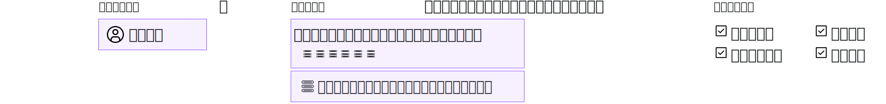

---

copyright:

  years: 2017, 2019

lastupdated: "2019-05-14"

keywords: SoftLayer permissions, classic infrastructure access, classic infrastructure permission, migrated SoftLayer permissions, migrated permission access group

subcollection: iam

---

{:shortdesc: .shortdesc}
{:codeblock: .codeblock}
{:screen: .screen}
{:important: .important}
{:new_window: target="_blank"}

# クラシック・インフラストラクチャー許可
{: #infrapermission}

ユーザーをアカウントに招待する際、3 つのクラシック・インフラストラクチャー許可セット (「表示のみ」、「基本ユーザー」、および「スーパーユーザー」) から選択することができます。これらの許可セットは、一括アクセス権限を割り当てるものです。
{:shortdesc}

他のユーザーをアカウントに招待する際は、アカウント所有者、または「ユーザーの管理」クラシック・インフラストラクチャー許可を持つユーザーのみが、招待されたユーザーの許可を調整できます。 アカウント所有者でないユーザーは、既に自分に割り当てられているレベルの許可またはそのサブセットのみを割り当てることができます。 アカウント所有者は、アカウント内のどのユーザーの許可でも、任意のレベルのアクセス権限を持つように更新することができます。

ユーザーが招待を受け入れた後、追加の許可を設定できます。 例えば、招待時に割り当てられた初期許可セットではデバイスへのアクセス権限は付与されません。 そのため、ユーザーが招待を受け入れた後で、デバイスへのアクセス権限を付与する必要があります。 詳しくは、『[クラシック・インフラストラクチャー・アクセス権限の管理](/docs/iam?topic=iam-mngclassicinfra#mngclassicinfra)』を参照してください。

以下の図は、ユーザーごとにクラシック・インフラストラクチャー許可をどのように割り当てるかを示しています。 細分化された許可オプションから選択することで、各ユーザーに特定のクラシック・インフラストラクチャー・サービスまたはクラシック・インフラストラクチャー・デバイスへのアクセス権限を付与し、各ユーザーのアクセス権限をカスタマイズできます。

## マイグレーションされたクラシック・インフラストラクチャー許可
{: #predefined}

請求情報の表示と管理およびサポート Case の処理を行うための一連のクラシック・インフラストラクチャー許可は、アクセス・グループにマイグレーションされることになりました。 以前にこれらの許可を割り当てられていた、アカウント内のユーザーは、マイグレーションされた対応する許可アクセス・グループに割り当てられることになります。 結果として、それらのクラシック・インフラストラクチャー許可は IAM アクセス・ポリシーを使用して直接管理できるようになります。 マイグレーションされた許可と、それぞれに使用されるアクセス・グループについて詳しくは、『[マイグレーションされた SoftLayer アカウント許可の管理](/docs/iam?topic=iam-migrated_permissions)』を参照してください。
