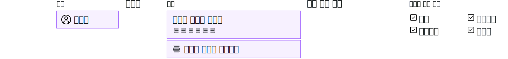

---

copyright:

  years: 2017, 2019

lastupdated: "2019-05-14"

keywords: SoftLayer permissions, classic infrastructure access, classic infrastructure permission, migrated SoftLayer permissions, migrated permission access group

subcollection: iam

---

{:shortdesc: .shortdesc}
{:codeblock: .codeblock}
{:screen: .screen}
{:important: .important}
{:new_window: target="_blank"}

# 클래식 인프라 권한
{: #infrapermission}

계정으로 사용자를 초대하는 경우 대량 액세스를 지정하는 세 가지 클래식 인프라 권한 세트(보기 전용, 기본 사용자, 수퍼유저)에서 선택할 수 있습니다.
{:shortdesc}

계정에 사용자를 초대하면, 자신, 계정 소유자 또는 사용자 클래식 인프라 관리 권한을 가진 사용자만 사용자에 대한 권한을 조정할 수 있습니다. 계정 소유자가 아닌 경우 이미 지정한 권한의 서브세트 또는 권한의 레벨만 지정할 수 있습니다. 계정 소유자는 액세스 레벨을 갖도록 계정의 임의 사용자의 권한을 업데이트할 수 있습니다.

사용자가 초대를 수락한 후에 추가 권한을 설정할 수 있습니다. 예를 들어, 초대에 지정된 초기 권한 세트는 디바이스에 액세스를 부여하지 않습니다. 따라서 사용자가 초대를 수락한 후 디바이스 액세스를 부여해야 합니다. 자세한 정보는 [클래식 인프라 액세스 관리](/docs/iam?topic=iam-mngclassicinfra#mngclassicinfra)를 참조하십시오.

다음 그래픽에서는 사용자당 클래식 인프라 권한을 지정하는 방식을 보여줍니다. 세부 단위의 권한 옵션 중에서 선택하여 각 사용자의 액세스 권한을 사용자 정의하면 각 사용자에게 클래식 인프라 서비스 또는 디바이스에 대한 액세스 권한을 부여할 수 있습니다.

## 마이그레이션된 클래식 인프라 권한
{: #predefined}

청구 정보를 보고 관리하며 지원 케이스에 대한 작업을 수행하기 위한 클래식 인프라 권한 세트가 이제 액세스 그룹으로 마이그레이션됩니다. 이전에 이러한 권한이 지정된 계정의 사용자가 이제 마이그레이션된 각 권한 액세스 그룹에 지정됩니다. 결과적으로 IAM 액세스 정책을 사용하여 클래식 인프라 권한을 직접 관리할 수 있습니다. 마이그레이션된 권한 및 각 권한에 사용되는 액세스 그룹에 대한 자세한 정보는 [마이그레이션된 SoftLayer 계정 권한 관리](/docs/iam?topic=iam-migrated_permissions)를 참조하십시오. 
