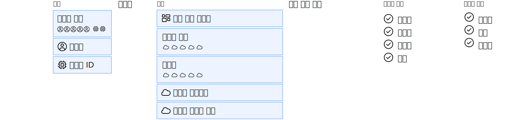

---

copyright:

  years: 2015, 2019

lastupdated: "2019-06-04"

keywords: IAM access, access policy, IAM roles, platform management roles, service access roles, types of access policies

subcollection: iam

---

{:shortdesc: .shortdesc}
{:codeblock: .codeblock}
{:screen: .screen}
{:tip: .tip}
{:note: .note}
{:new_window: target="_blank"}

# IAM 액세스
{: #userroles}

계정의 리소스 그룹으로 구성된 모든 서비스는 {{site.data.keyword.Bluemix_notm}} Identity and Access Management(IAM)를 사용하여 관리됩니다. 계정 소유자에게는 Cloud IAM에 대한 계정 관리자 역할이 자동으로 지정됩니다. 계정 관리자인 경우에는 사용자에 대한 액세스를 지정 및 관리하고, 리소스 그룹을 작성하며, 액세스 그룹을 작성하고, 청구 세부사항 및 추적 사용량을 보고, 서비스 인스턴스를 작성할 수 있습니다. 허용되는 액세스 유형을 정의하는 역할 및 액세스에 대한 정책의 주체(Subject)에 해당하는 대상을 설정하는 정책을 작성하여 사용자, 서비스 ID, 액세스 그룹에 대한 액세스를 제공합니다.
{: shortdesc}

## Cloud IAM 정책의 정의 및 이를 지정할 수 있는 사용자
{: #iamusermanpol}

지정된 대상 리소스의 컨텍스트 내에서 특정 조치가 수행될 수 있도록 정책을 통해 리소스 세트에 대한 하나 이상의 역할을 주체(subject)에 부여합니다.

다음 그래픽을 사용하면 IAM 정책 작성 방법을 설명할 수 있습니다. 정책은 항상 주체를 먼저 지정하여 작성합니다. 주체는 특정 사용자, 서비스 ID 또는 액세스 그룹입니다. 다음으로 사용자가 액세스할 수 있는 사항인 정책의 대상을 선택합니다(예: 리소스 그룹의 모든 서비스, 계정에 있는 모든 IAM 사용 서비스, 계정 관리 서비스 또는 특정 서비스 인스턴스). 마지막으로 사용 가능한 역할에서 선택하여 액세스 정책을 완료합니다. 이 역할을 통해 사용자가 완료할 수 있는 조치를 정확히 정의합니다. 선택하는 서비스에 따라 추가 구성 옵션을 사용할 수 있습니다.

적절한 역할이 있으면 정책을 지정하고 관리할 수 있습니다. 다음 표에서는 정책 관리 태스크 및 각각에 필요한 역할을 보여줍니다.

|조치 | 필수 역할 |
|----------|---------|
|모든 서비스 및 인스턴스에 대해 계정에서 정책 작성 | 모든 계정 관리 서비스 및 모든 ID 및 액세스 사용 서비스의 계정 소유자 또는 관리자 |
|계정에서 서비스에 대한 정책 작성 | 계정 소유자, 모든 ID 및 액세스 사용 서비스의 관리자 또는 계정에서 서비스의 관리자 |
|서비스 인스턴스에 대한 정책 작성 |계정 소유자, 모든 ID 및 액세스 사용 서비스의 관리자, 계정의 서비스에 대한 관리자, 관련 리소스 그룹의 모든 서비스에 대한 관리자 또는 서비스 인스턴스에 대한 관리자 |
{: caption="표 1. 액세스 정책을 작성할 수 있는 사용자" caption-side="top"}

## 공통 액세스 정책 유형
{: #policytypes}

다음 유형의 액세스 정책을 지정하여 사용자, 서비스 ID 또는 액세스 그룹에 대한 세분화된 액세스를 제공할 수 있습니다.

* 모든 계정 관리 서비스
* 특정 계정 관리 서비스
* 계정 내의 모든 리소스
* 리소스 그룹 관리 기능과 함께 개별 리소스 그룹에 속하는 모든 서비스 내의 모든 리소스
* 리소스 그룹 관리 기능과 함께 리소스 그룹의 단일 서비스 내의 모든 리소스
* 리소스가 지정된 리소스 그룹과 관계없는, 계정 전체의 단일 서비스 내 모든 리소스
* 개별 인스턴스의 리소스
* 인스턴스 내의 단일 리소스 유형(예: {{site.data.keyword.objectstorageshort}} 인스턴스의 버킷)

사용자 액세스를 관리하고 모든 계정 리소스를 관리하는 용도로 계정에 대한 전체 액세스 권한을 다른 사용자에게 부여하려면, 두 개 정책을 지정해야 합니다. 하나의 정책은 지정된 **관리자(Administrator)** 및 **관리자(Manager)** 역할로 **모든 ID 및 액세스 사용 서비스**를 선택하여 계정의 모든 리소스에 대한 사용자 액세스를 제공하는 정책입니다. 그리고 또 하나의 정책은 지정된 **관리자**역할로 **모든 계정 관리 서비스**를 선택하여 계정의 모든 계정 관리 리소스에 대한 사용자 액세스를 제공하는 정책입니다.
{: tip}

## Cloud IAM 역할
{: #iamusermanrol}

Cloud IAM에서는 계정에서 사용자 및 리소스에 대한 액세스를 관리하고 정의할 수 있습니다. 플랫폼 관리 역할 및 서비스 액세스 역할과 같은 두 가지 유형의 역할을 지정할 수 있습니다.

<dl>
<dt>플랫폼 관리 역할</dt>
<dd>플랫폼 관리 역할은 인스턴스 작성 및 삭제 기능, 별명, 바인딩, 인증 정보 관리 기능, 액세스 관리 기능을 포함하여 다양한 조치를 포함합니다. 플랫폼 역할로는 관리자, 편집자, 운영자, 뷰어가 있습니다. 플랫폼 관리 역할은 사용자가 계정 관리 서비스에 대해 지정된 역할에 따라 사용자를 초대하고, 서비스 ID, 액세스 정책 및 카탈로그 항목을 관리하고, 청구 및 사용량을 추적할 수 있도록 하는 [계정 관리 서비스](/docs/iam?topic=iam-account-services#account-services)에도 적용됩니다.</dd>
<dt>서비스 액세스 역할</dt>
<dd>서비스 액세스 역할은 서비스 인스턴스에 대한 조치를 수행하기 위한 사용자 또는 서비스의 기능을 정의합니다(예: 콘솔에 액세스 또는 API 호출 수행). 서비스 액세스 역할로는, 관리자, 기록자, 독자가 있습니다. </dd>
</dl>

선택한 서비스에 사용 가능한 역할만 표시되므로 UI에서 정책을 지정할 때 여기에 옵션으로 나열되는 일부 역할이 표시되지 않을 수도 있습니다. 사용되는 역할 및 각 액세스 역할이 서비스마다 허용하는 조치에 대한 자세한 정보는 해당 서비스에 대한 문서를 참조하십시오.
{: note}

### 플랫폼 관리 역할
{: #platformroles}

플랫폼 관리 역할을 사용하면 계정 및 서비스 내에서 플랫폼 조치를 수행할 수 있는 다양한 권한 레벨을 사용자에게 지정할 수 있습니다. 예를 들어, 카탈로그 리소스에 대해 지정된 플랫폼 관리 역할을 통해 사용자는 서비스 인스턴스 작성, 삭제, 편집, 보기와 같은 조치를 완료할 수 있습니다. 그리고 계정 관리 서비스에 대해 지정된 플랫폼 관리 역할을 통해 사용자는 사용자 초대 및 제거, 리소스 그룹에 대한 작업, 청구 정보 보기와 같은 조치를 완료할 수 있습니다. 계정 관리 서비스에 대한 자세한 정보는 [계정 관리 서비스에 대한 액세스 권한 지정](/docs/iam?topic=iam-account-services#account-services)을 참조하십시오.

정책을 작성할 때 적용하는 모든 역할을 선택하십시오. 각 역할은 별도의 조치가 완료되도록 허용하며 더 작은 역할의 조치를 상속하지 않습니다.
{: tip}

다음 표에서는 사용자가 카탈로그 리소스 및 리소스 그룹 컨텍스트 내에서 수행할 수 있는 일부 플랫폼 관리 조치의 예를 제공합니다. 각 카탈로그 오퍼링에 대한 문서를 참조하면 사용 중인 서비스의 컨텍스트 내에서 사용자에게 역할이 적용되는 방법을 파악할 수 있습니다.

|  | 하나 또는 모든 IAM 사용 서비스 |리소스 그룹의 선택된 서비스 |선택된 리소스 그룹 |
|:--------------|:------------|:-------------|:-------------|
|뷰어 역할 |인스턴스, 별명, 바인딩 및 인증 정보 보기 |리소스 그룹의 지정된 인스턴스만 보기 |리소스 그룹 보기 |
|운영자 역할 |인스턴스 보기 및 별명, 바인딩 및 인증 정보 관리 |해당사항 없음 |해당사항 없음 |
|편집자 역할 |인스턴스를 작성, 삭제, 편집하고 봅니다. 별명, 바인딩 및 인증 정보를 관리합니다. |리소스 그룹의 지정된 인스턴스만 작성, 삭제, 편집, 일시중단, 재개, 보기 및 바인드 |리소스 그룹의 이름 보기 및 편집 |
|관리자 역할 |서비스에 대한 모든 관리 조치 |리소스 그룹의 지정된 인스턴스에 대한 모든 관리 조치 |리소스 그룹에 대한 액세스 보기, 편집 및 관리 |
{: row-headers}
{: class="comparison-table"}
{: caption="표 2. 계정의 서비스에 대한 플랫폼 관리 역할 및 조치 예" caption-side="top"}
{: summary="The first row of the table describes separate options that you can choose from when creating a policy, and the first column describes the selected roles for the policy. The remaining cells map to which role is selected from the first column, and which type of policy has been selected from the options in the first row."}
{: #platformrolestable1}

계정 관리 서비스에 지정된 역할을 기반으로 사용자가 수행할 수 있는 특정 조치에 대한 자세한 정보는 [계정 관리 서비스에 대한 액세스 권한 지정](/docs/iam?topic=iam-account-services)을 참조하십시오.
{: #acctmgmt}

일부 서비스는 서비스 액세스가 아닌 서비스 관리와 관련된 플랫폼 관리 역할에 특정 조치를 맵핑할 수 있습니다. 한 예로, 이러한 역할에 맵핑된 {{site.data.keyword.containershort_notm}} 서비스 조치를 자세히 설명하는 다음 표를 참조하십시오.

| 플랫폼 관리 역할 |조치 | {{site.data.keyword.containershort_notm}}의 예제 조치 |
|:-----------------|:-----------------|:-----------------|
|뷰어 |서비스 인스턴스를 볼 수 있지만 수정할 수는 없습니다.  | <ul><li>클러스터 나열</li><li>클러스터에 대한 세부사항 보기</li></ul>|
|편집자 |계정 관리 및 액세스 정책 지정을 제외하고 모든 플랫폼 조치를 수행합니다. |<ul><li>클러스터에 서비스 바인드</li><li>웹훅 작성</li></ul> |
|운영자 |서비스 인스턴스 구성 및 작동에 필요한 플랫폼 조치를 수행합니다(서비스 대시보드 보기 등). | <ul><li>작업자 노드 추가 또는 제거</li><li>작업자 노드 다시 시작 또는 다시 로드</li><li>클러스터에 서비스 바인드</li></ul> |
|관리자 |이 역할이 지정되는 리소스에 따라 모든 플랫폼 조치를 수행합니다(다른 사용자에게 액세스 정책 지정 포함). |<ul><li>클러스터 제거</li><li>클러스터 작성</li><li>사용자 액세스 정책 업데이트</li><li>뷰어, 편집자, 운영자가 수행할 수 있는 모든 조치</li></ul>|
{: caption="표 3. {{site.data.keyword.containershort_notm}} 서비스에 대한 플랫폼 관리 역할 및 조치 예" caption-side="top"}

### 서비스 액세스 역할
{: #service_access_roles}

서비스 액세스 역할은 서비스 API 호출 및 서비스에 대한 UI 액세스를 위한 다양한 권한 레벨이 사용자에게 지정되도록 합니다. 다음 표에서는 {{site.data.keyword.objectstorageshort}} 서비스의 사용을 기반으로 하여 지정된 역할에 따라 취할 수 있는 조치의 예를 제공합니다.

지정된 각 역할에서 수행할 수 있는 조치는 정책에 대해 선택한 서비스에 따라 다릅니다. 일부 서비스에서는 해당 유형의 역할을 사용하지 않습니다. 자세한 정보는 서비스 문서를 참조하십시오.
{: note}

| 서비스 액세스 역할 |조치 | {{site.data.keyword.objectstorageshort}} Service의 예제 조치 |
|:-----------------|:-----------------|:-----------------|
|독자 |서비스 특정 리소스 보기와 같은 서비스 내 읽기 전용 조치를 수행합니다. |오브젝트 나열 및 다운로드 |
|작성자 |서비스 특정 리소스 작성 및 편집을 포함해 독자 역할 이상의 권한을 갖습니다. |버킷 및 오브젝트 작성 및 영구 삭제 |
|관리자 |서비스에서 정의한 대로 권한 부여된 조치를 완료하고 서비스별 리소스를 작성하고 편집하기 위해 작성자 역할 이상의 권한을 갖습니다, |모든 측면의 데이터 스토리지 관리, 버킷 및 오브젝트 작성 및 영구 삭제 |
{: caption="표 4. 서비스 액세스 사용자 역할 및 조치 예" caption-side="top"}
