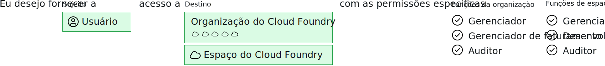

---

copyright:

  years: 2017, 2019

lastupdated: "2019-04-02"

keywords: Cloud Foundry roles, Cloud Foundry access, auditor, manager, developer, billing manager

subcollection: iam

---

{:shortdesc: .shortdesc}
{:codeblock: .codeblock}
{:screen: .screen}
{:new_window: target="_blank"}
{:tip: .tip}
{:note: .note}

# Acesso ao Cloud Foundry
{: #cfaccess}

Atualmente, nem todos os serviços podem ser gerenciados usando o Cloud IAM. É possível continuar a usar
funções do Cloud Foundry para acessar essas instâncias de serviço. Os usuários são incluídos na organização e
no espaço aos quais a instância pertence com uma função do Cloud Foundry designada.
{:shortdesc}

O gráfico a seguir descreve como as organizações, os espaços e as funções do Cloud Foundry estão relacionados em uma conta. Uma conta pode ter muitos usuários, organizações e espaços. Cada usuário pode ser designado a tantas organizações e espaços quanto o necessário e, quando eles são designados a uma organização e a um espaço, é possível configurar o nível de acesso para trabalhar dentro de cada um designando uma função do Cloud Foundry.

## Funções do Cloud Foundry
{: #cfroles}

As funções do Cloud Foundry concedem acesso a organizações e espaços dentro da conta. As funções do Cloud Foundry não ativam as permissões de usuário para concluir ações dentro do contexto de um serviço na conta.

O acesso ao Cloud Foundry é designado incluindo um usuário em uma organização e em um espaço e, em seguida, designando uma função de organização e uma função de espaço. Dependendo do tipo de função que é designado, esse usuário pode concluir ações específicas para instâncias de serviço incluídas em um espaço específico.

As funções a seguir podem ser designadas no nível de organização:

| Função organizacional | Permissões |
|-------------------|-------------|
|Gerenciador | Os gerenciadores de organização podem criar, visualizar, editar ou excluir espaços dentro da organização, visualizar o uso e cota da organização, convidar os usuários para a organização, gerenciar quem tem acesso à organização e suas funções na organização, além de gerenciar domínios customizados para a organização. |
|Gerenciador de faturamento | Os gerentes de faturamento podem visualizar informações de tempo de execução e de uso de serviço para a organização na página Uso.  |
|Auditor | Auditores da organização podem visualizar o conteúdo do aplicativo e do serviço na organização. Os auditores também podem visualizar os usuários na organização e suas funções designadas, além da cota da organização. |
{:caption="Tabela 1. Funções e permissões de organização" caption-side="top"}

As funções a seguir podem ser designadas no nível de espaço:

| Função de espaço | Permissões |
|------------|-------------|
|Gerenciador | Os gerenciadores de espaço podem incluir usuários existentes e gerenciar funções dentro do espaço. O gerenciador de espaço também pode visualizar o número de instâncias, ligações de serviço e
o uso recurso para cada aplicativo no espaço. |
|Desenvolvedor | Desenvolvedores de espaço podem criar, excluir e gerenciar aplicativos e serviços dentro do espaço. Algumas das tarefas de gerenciamento incluem implementação de apps, início ou parada de aplicativos,
renomeação de um app, exclusão de um app, renomeação de um espaço, ligação ou desvinculação de um serviço para
um aplicativo, visualização do número ou de instâncias, ligações de serviço e uso de recurso para cada
aplicativo no espaço. Além disso, o desenvolvedor de espaço pode associar uma URL interna ou externa com um aplicativo no espaço.   |
|Auditor | Auditores de espaço têm acesso somente leitura a todas as informações sobre o espaço, como informações sobre o número de instâncias, ligações de serviço e uso de recurso para cada aplicativo no
espaço. |
{:caption="Tabela 2. Funções e permissões de espaço" caption-side="top"}

Os usuários que são designados à função de espaço de gerenciador ou desenvolvedor podem acessar a variável de ambiente VCAP_SERVICES. No entanto, um usuário designado à função de auditor não pode acessar VCAP_SERVICES.
{: note}
