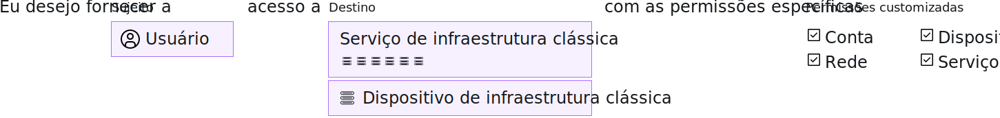

---

copyright:

  years: 2017, 2019

lastupdated: "2019-05-14"

keywords: SoftLayer permissions, classic infrastructure access, classic infrastructure permission, migrated SoftLayer permissions, migrated permission access group

subcollection: iam

---

{:shortdesc: .shortdesc}
{:codeblock: .codeblock}
{:screen: .screen}
{:important: .important}
{:new_window: target="_blank"}

# Permissões de infraestrutura clássica
{: #infrapermission}

Quando você convida um usuário para sua conta, é possível selecionar entre três conjuntos de permissões de infraestrutura clássica que designam acesso em massa: Somente visualização, Usuário básico, Superusuário.
{:shortdesc}

Quando você convida alguém para a conta, somente você, o proprietário da conta ou um usuário com a permissão Gerenciar a infraestrutura clássica de usuários pode ajustar as permissões para o usuário. É possível designar somente o nível de permissões ou um subconjunto da permissão que você já tem designada, se você não for o proprietário da conta. Um proprietário da conta pode atualizar as permissões de qualquer pessoa na conta para ter qualquer nível de acesso.

Permissões adicionais podem ser configuradas depois que o usuário aceita o convite. Por exemplo, o conjunto de permissões inicial designado no convite não concede acesso a dispositivos. Portanto, deve-se conceder acesso ao dispositivo após o usuário aceitar o convite. Para obter mais informações, veja [Gerenciando o acesso de infraestrutura clássica](/docs/iam?topic=iam-mngclassicinfra#mngclassicinfra).

O gráfico a seguir mostra como as permissões de infraestrutura clássica são designadas por usuário. É possível conceder a cada usuário acesso a um serviço ou dispositivo de infraestrutura clássica selecionando, nas opções de permissão granular, a customização do acesso de cada usuário.

## Permissões de infraestrutura clássica migradas
{: #predefined}

Um conjunto de permissões de infraestrutura clássica para visualizar e gerenciar informações de faturamento e trabalhar com casos de suporte é agora migrado para grupos de acesso. Os usuários em sua conta que foram designados anteriormente a essas permissões agora são designados ao respectivo grupo de acesso de permissão migrado. Como resultado, as permissões de infraestrutura clássica podem ser gerenciadas diretamente usando as políticas de acesso do IAM. Para obter mais informações sobre as permissões migradas e os grupos de acesso que são usados para cada uma, consulte [Gerenciando permissões de conta SoftLayer migradas](/docs/iam?topic=iam-migrated_permissions).
