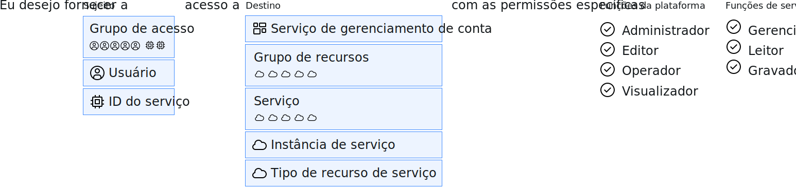

---

copyright:

  years: 2015, 2019

lastupdated: "2019-06-04"

keywords: IAM access, access policy, IAM roles, platform management roles, service access roles, types of access policies

subcollection: iam

---

{:shortdesc: .shortdesc}
{:codeblock: .codeblock}
{:screen: .screen}
{:tip: .tip}
{:note: .note}
{:new_window: target="_blank"}

# Acesso ao IAM
{: #userroles}

Todos os serviços que são organizados em um grupo de recursos em sua conta são gerenciados usando o {{site.data.keyword.Bluemix_notm}} Identity and Access Management (IAM). Os proprietários de contas são designados automaticamente à função de administrador de conta para o Cloud IAM. Como o administrador de conta, é possível designar e gerenciar o acesso para usuários, criar grupos de recursos, criar grupos de acesso, visualizar detalhes do faturamento, controlar o uso e criar instâncias de serviço. Forneça
acesso a usuários, IDs de serviço e grupos de acesso criando políticas que configurem um destino para o
assunto da política a ser acessada e uma função que defina qual tipo de acesso será permitido.
{: shortdesc}

## O que são políticas do Cloud IAM e quem pode designá-las?
{: #iamusermanpol}

Uma política concede a um sujeito uma ou múltiplas funções a um conjunto de recursos para que ações específicas possam ser executadas dentro do contexto dos recursos de destino especificados.

O gráfico a seguir ajuda a explicar como a política do IAM é criada. As políticas são sempre criadas especificando primeiro o sujeito. O sujeito é um usuário específico, o ID do serviço ou um grupo de acesso. Em seguida, o destino da política é selecionado, que representa o que você está permitindo que o usuário acesse, por exemplo: todos os serviços em um grupo de recursos, todos os serviços ativados pelo IAM na conta, os serviços de gerenciamento de conta ou uma instância de serviço específica. Por fim, você conclui sua política de acesso selecionando entre as funções disponíveis. Essas funções definem exatamente quais ações um usuário pode concluir. Mais opções de configuração podem estar disponíveis, dependendo do serviço selecionado.

Será possível designar e gerenciar políticas se você possuir a função adequada. A tabela a seguir mostra as tarefas de gerenciamento de política e a função que é necessária para cada uma.

| Ações | Função necessária |
|----------|---------|
| Criar uma política em uma conta para todos os serviços e instâncias | Proprietário da conta ou administrador em todos
os serviços de gerenciamento de conta e todos os serviços ativados para o Identity and Access |
| Criar uma política em um serviço em uma conta | Proprietário da conta, administrador em todos os serviços ativados para
o Identity and Access ou administrador no serviço na conta |
| Criar uma política em uma instância de serviço | Proprietário da conta, administrador em todos os serviços ativados
para o Identity and Access, administrador no serviço na conta, administrador em todos os serviços no grupo de
recursos relevantes ou administrador na instância de serviço |
{: caption="Tabela 1. Usuários que têm permissão para criar políticas de acesso" caption-side="top"}

## Tipos de política de acesso comum
{: #policytypes}

É possível fornecer acesso de baixa granularidade para os usuários, os IDs de serviço ou os grupos de acesso
designando os tipos de políticas de acesso a seguir:

* Todos os serviços de gerenciamento de conta
* Serviço gerenciamento de conta específico
* Todos os recursos na conta
* Todos os recursos dentro de todos os serviços que pertencem a um grupo de recursos individuais com a capacidade de
gerenciar o grupo de recursos
* Todos os recursos dentro de um único serviço em um grupo de recursos com a capacidade de gerenciar o grupo de
recursos
* Todos os recursos dentro de um único serviço na conta, independentemente do grupo de recursos ao qual eles estão designados
* Recursos em uma instância individual
* Um tipo de recurso único dentro de uma instância, por exemplo, um depósito em uma instância do {{site.data.keyword.objectstorageshort}}

Para conceder a outro usuário acesso total à conta para os propósitos de gerenciamento de acesso de usuário e gerenciamento de todos os recursos de conta, deve-se designar duas políticas. Uma política que fornece ao usuário acesso a todos os recursos na conta selecionando **Todos os serviços ativados de identidade e acesso** com as funções **Administrador** e **Gerenciador** designadas. Uma política que conceda ao usuário acesso a todos os serviços de gerenciamento de conta na conta selecionando
**Todos os serviços de gerenciamento de conta** com a função **Administrador** designada.
{: tip}

## Funções do Cloud IAM
{: #iamusermanrol}

Com o Cloud IAM, é possível gerenciar e definir acesso para usuários e recursos em sua conta. Dois tipos de
funções podem ser designadas: funções de gerenciamento de plataforma e funções de acesso de serviço.

<dl>
<dt>Funções de gerenciamento de plataforma</dt>
<dd>As funções de gerenciamento da plataforma abrangem uma gama de ações, incluindo a capacidade de criar e
excluir instâncias, gerenciar aliases, ligações, credenciais e acesso. As funções da plataforma são administrador,
editor, operador, visualizador. As funções de gerenciamento de plataforma também se aplicam aos [serviços de gerenciamento de conta](/docs/iam?topic=iam-account-services#account-services) que permitem que os usuários convidem usuários, gerenciem IDs de serviço, políticas de acesso, entradas do catálogo e rastreiem o faturamento e o uso, dependendo da atribuição designada em um serviço de gerenciamento de conta.</dd>
<dt>Funções de acesso de serviço</dt>
<dd>As funções de acesso de serviço definem a capacidade de um usuário ou serviço executar ações em uma instância de serviço, como acessar o console ou executar chamadas API. As funções de acesso de serviço são gerenciador, gravador e leitor. </dd>
</dl>

Você pode não ver todas as funções que estão listadas aqui como opções ao designar as políticas na UI, pois
somente as funções disponíveis para o serviço escolhido serão exibidas. Para obter mais informações sobre quais funções estão ativadas e quais ações cada função de acesso permite para cada serviço, veja a documentação para esse serviço.
{: note}

### Funções de gerenciamento de plataforma
{: #platformroles}

Com as funções de gerenciamento de plataforma, os usuários podem receber níveis variados de permissão para executar ações de plataforma dentro da conta e em um serviço. Por exemplo, as funções de gerenciamento
da plataforma que são designadas para os recursos do catálogo permitem que os usuários concluam ações como, criar,
excluir, editar e visualizar instâncias de serviço. Além disso, as funções de gerenciamento da plataforma que são
designadas para os serviços de gerenciamento de conta permitem que os usuários concluam ações como, convidar e remover
usuários, trabalhar com grupos de recursos e visualizar as informações de faturamento. Para obter mais informações sobre os serviços de gerenciamento de conta, consulte [Designando acesso a serviços de gerenciamento de conta](/docs/iam?topic=iam-account-services#account-services).

Selecione todas as funções que se aplicam ao criar uma política. Cada função permite que ações separadas sejam concluídas e não herdam as ações das funções menores.
{: tip}

A tabela a seguir fornece exemplos de algumas das ações de gerenciamento de plataforma que os usuários podem executar no contexto dos recursos de catálogo e dos grupos de recursos. Consulte a documentação para cada oferta de catálogo para entender como as funções se aplicam aos usuários dentro do contexto do serviço que está sendo usado.

|  | Um ou todos os serviços ativados por IAM | Serviço selecionado em um grupo de recursos | Grupo de recursos selecionados |
|:--------------|:------------|:-------------|:-------------|
| Função de visualizador | Visualizar instâncias, aliases, ligações e credenciais | Visualizar somente instâncias especificadas no grupo de recursos | Visualizar grupo de recursos |
| Função de operador |  Visualizar instâncias e gerenciar aliases, ligações e credenciais |  Não aplicável | Não aplicável |
| Função do editor |  Criar, excluir, editar e visualizar instâncias. Gerenciar aliases, ligações e credenciais | Criar, excluir, editar, suspender, continuar, visualizar e ligar somente as instâncias especificadas no grupo de recursos | Visualizar e editar o nome do grupo de recursos |
| Função de administrador |  Todas as ações de gerenciamento para serviços | Todas as ações de gerenciamento para as instâncias especificadas no grupo de recursos | Visualizar, editar e gerenciar o acesso para o grupo de recursos |
{: row-headers}
{: class="comparison-table"}
{: caption="Tabela 2. Exemplo de funções de gerenciamento da plataforma e ações para os serviços em uma conta" caption-side="top"}
{: summary="The first row of the table describes separate options that you can choose from when creating a policy, and the first column describes the selected roles for the policy. The remaining cells map to which role is selected from the first column, and which type of policy has been selected from the options in the first row."}
{: #platformrolestable1}

Para obter informações sobre ações específicas que os usuários podem executar com base em sua função designada nos serviços de gerenciamento de conta, consulte [Designando o acesso aos serviços de gerenciamento de conta](/docs/iam?topic=iam-account-services).
{: #acctmgmt}

Alguns serviços podem mapear ações específicas para as funções de gerenciamento de plataforma que estão relacionadas ao gerenciamento do serviço em vez do acesso do serviço. Como um exemplo, consulte a tabela a seguir que detalha as ações de serviço do {{site.data.keyword.containershort_notm}} mapeadas para essas funções.

| Função de gerenciamento da plataforma | Ações | Exemplo de ações para o {{site.data.keyword.containershort_notm}} |
|:-----------------|:-----------------|:-----------------|
| Visualizador | Pode visualizar instâncias de serviço, mas não pode modificá-las  | <ul><li>Listar clusters</li><li>Visualizar detalhes para um cluster</li></ul>|
| Editor | Executar todas as ações da plataforma, exceto para gerenciar a conta e designar políticas de acesso |<ul><li>Ligar um serviço a um cluster</li><li>Criar um webhook</li></ul> |
| Operador | Executar ações de plataforma necessárias para configurar e operar instâncias de serviço, como visualizar o painel de um serviço | <ul><li>Incluir ou remover nós do trabalhador</li><li>Reiniciar ou recarregar nós do trabalhador</li><li>Ligar um serviço a um cluster</li></ul> |
| Administrador | Executar todas as ações da plataforma com base no recurso para o qual essa função está sendo designada, incluindo a designação de políticas de acesso a outros usuários |<ul><li>Remover um cluster</li><li>Criar um cluster</li><li>Atualizar políticas de acesso de usuário</li><li>Todas as ações que um visualizador, um editor e um operador podem executar</li></ul>|
{: caption="Tabela 3. Exemplo de funções e ações de gerenciamento de plataforma para o serviço {{site.data.keyword.containershort_notm}}" caption-side="top"}

### Funções de acesso de serviço
{: #service_access_roles}

As funções de acesso ao serviço permitem que os usuários sejam designados a diferentes níveis de permissão para chamar a API do serviço e acessar a UI para o serviço. A tabela a seguir fornece exemplos de ações que podem ser tomadas dependendo das funções designadas com base no uso do serviço {{site.data.keyword.objectstorageshort}}.

As ações que podem ser executadas com base em cada função designada variam com base no serviço que você selecionou para a política. Nem todos os serviços usam esses tipos de funções. Consulte a documentação para o serviço para obter mais detalhes.
{: note}

| Função de acesso de serviço | Ações | Exemplo de ações para o serviço do {{site.data.keyword.objectstorageshort}} |
|:-----------------|:-----------------|:-----------------|
|  Leitor | Executar ações somente leitura em um serviço, como visualizar recursos específicos do serviço | Listar e fazer download de objetos |
| Gravador | Permissões além da função de leitor, incluindo criar e editar recursos específicos do serviço | Criar e destruir depósitos e objetos |
| Gerenciador | Permissões além da função de gravador para concluir ações privilegiadas, conforme definido pelo serviço, além de criar e editar recursos específicos do serviço | Gerenciar todos os aspectos de armazenamento de dados, criar e destruir depósitos e objetos |
{: caption="Tabela 4. Exemplo de funções de usuário e ações de acesso ao serviço" caption-side="top"}
