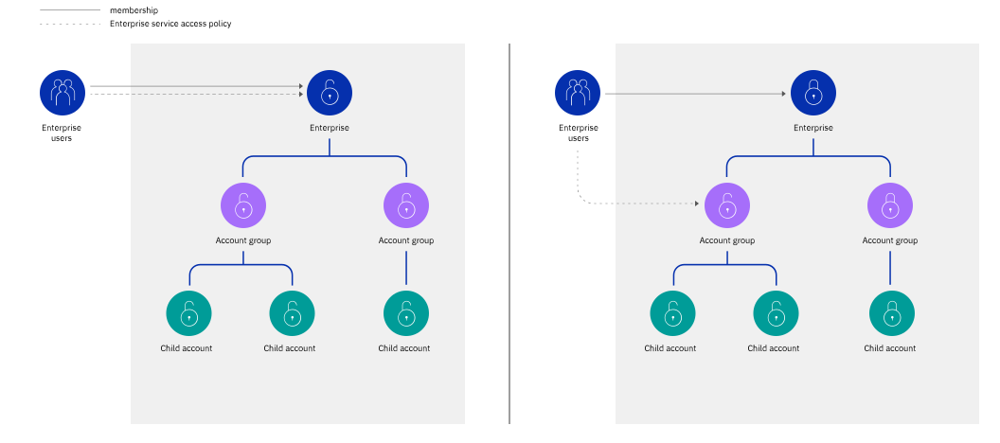

---

copyright:

  years: 2019

lastupdated: "2019-07-24"

keywords: enterprise policy, enterprise access, assign enterprise access, enterprise service

subcollection: iam

---

{:shortdesc: .shortdesc}
{:codeblock: .codeblock}
{:screen: .screen}
{:new_window: target="_blank"}
{:tip: .tip}
{:note: .note}
{:external: target="_blank" .external}

# 分配企业访问权
{: #assign-access-enterprise}

要为用户分配管理 {{site.data.keyword.Bluemix}} 企业的访问权，必须邀请该用户加入企业帐户，并为其分配对企业帐户管理服务的访问权。
{:shortdesc}

用于管理[企业](/docs/account?topic=account-enterprise)的访问权需要企业帐户中的访问策略。在企业的子帐户中，为用户分配企业帐户管理服务策略时，用户无法管理该帐户所属的企业。根据在企业帐户中为用户分配的企业帐户管理服务的角色，用户可以执行特定操作：

* 在企业中创建新帐户
* 创建和命名帐户组
* 在帐户组之间移动帐户
* 将现有帐户导入到企业
* 更新企业名称或域
* 查看企业的使用情况报告，特定帐户组及其包含的帐户组或帐户的使用情况报告，或者特定帐户的使用情况报告

授予用户对企业服务的访问权的策略可以针对整个企业进行分配，也可以仅针对特定帐户组或单个帐户分配。
{: tip}

通常，企业帐户本身并不包含许多资源。相反，资源是在企业的子帐户中创建的。对于其中的每个帐户，可以邀请用户加入，并向其授予管理和使用资源的访问权。用户在企业帐户中具有的访问权和成员资格不会应用于企业层次结构中的帐户组和子帐户。每个帐户的用户管理和访问权管理保持隔离，如以下各图中所示。

第一个图显示了如何为企业帐户中的用户分配管理整个企业的策略，或分配作用域限定为帐户组的策略，以提供相应访问权用于仅管理该帐户组以及其中所组织的其他帐户组或子帐户。



策略的目标和角色对于确定访问权的作用域十分重要。企业中的用户、服务标识或访问组是策略的主体，可以完成整个企业、帐户组（可能包含其他帐户组和帐户）或者甚至是单个帐户中的企业管理任务。例如，如果为企业帐户中的用户分配了对企业帐户管理服务的访问策略，并且其目标的作用域限定为特定帐户组，那么该用户有权完成该帐户组中的任务。当目标设定为特定帐户组或帐户时，用户无法完成影响整个企业的操作，例如更新企业名称或域。

可以为企业的子帐户中的用户分配访问策略，使其只能管理该帐户或其中包含的资源。例如，如果为子帐户中的用户分配对企业帐户管理服务的角色，那么该用户无法在企业帐户级别执行操作。您必须将该用户添加到企业帐户，并在该上下文中为其分配相应策略。


## 特定作业的必需策略
{: #sample-enterprise-policies}

根据需要完成的作业，可能需要为非企业所有者的用户提供访问策略组合。以下示例提供了一组访问策略，企业中的用户必须分配有这些策略，才能完成特定任务。

如果您是不属于企业的帐户的所有者，但您希望帐户中的其他用户能够将帐户转换为企业，那么可以为该用户分配对缴费帐户管理服务的管理员角色。
{: note}

### 在企业中查看使用情况和管理计费
{: #billing-admin-enterprise}

要使用户能够针对企业中的所有帐户[查看使用情况报告](/docs/billing-usage?topic=billing-usage-enterprise-usage)、付款和查看发票，必须为其分配以下所有访问策略：

* 在企业帐户中对企业帐户管理服务的使用情况报告查看者角色
* 在企业帐户中对缴费帐户管理服务的管理员角色

### 将现有帐户导入到企业
{: #add-account}

要使用户能够[将现有 IBM Cloud 帐户导入到企业](/docs/account?topic=account-enterprise-add#add-accounts)，必须为其分配以下所有访问策略：

* 在要导入的帐户中对缴费帐户管理服务的管理员角色
* 在要添加帐户的帐户组或企业帐户中对企业帐户管理服务的管理员或编辑者角色
* 在企业帐户中对缴费帐户管理服务的管理员角色

### 移动帐户
{: #move-accountgroup}

要使用户能够[在企业中移动帐户](/docs/account?topic=account-enterprise-organize#move-accounts)，必须为其分配以下访问策略：

* 在企业帐户中对缴费帐户管理服务的管理员角色

然后，选择以下两个选项中的一个选项：

* 对整个企业的企业帐户管理服务的管理员或编辑者角色
* 对此帐户将移动到的当前和目标帐户组的管理员或编辑者角色

有关用户针对每个角色可以执行的操作的详细信息，请参阅[帐户管理服务的操作和角色](/docs/iam?topic=iam-account-services#account-management-actions-roles)。

## 在控制台中分配访问权
{: #enterprise-access-console}

要将访问策略分配给企业帐户中的现有用户，请完成以下步骤：

您可以将策略的目标设置为整个企业、特定帐户组（可以包含对其中所有帐户的访问权），或者甚至是帐户组中的特定帐户。
{: tip}

1. 在菜单栏中，单击**管理** &gt; **访问权 (IAM)**，然后选择**用户**。
2. 在要为其分配访问权的用户所在的行中，选择**操作**  菜单，然后单击**分配访问权**。
3. 选择分配对**帐户管理服务**的访问权。
4. 选择**企业**作为服务。
5. 可选：将策略的作用域限定为企业、帐户组或帐户。
6. 选择任意角色组合来分配所需的访问权。

|角色|操作|
|:-------|----------|
|查看者|查看企业、帐户组和帐户|
|操作员|查看企业、帐户组和帐户|
|编辑者|查看企业，通过编辑企业的名称和域来更新企业，创建帐户和帐户组，查看使用情况报告以及导入帐户|
|管理员|查看企业，通过编辑企业的名称和域来更新企业，创建帐户和帐户组，在帐户组之间移动帐户，导入现有帐户以及查看使用情况报告|
|使用情况报告查看者|查看企业、帐户和帐户组，以及查看企业中所有帐户的使用情况报告|
{: caption="表 1. 企业帐户管理服务的角色和示例操作" caption-side="top"}

## 使用 CLI 分配访问权
{: #enterprise-cli-policy}

要为用户创建新的访问策略，请运行 **`ibmcloud iam user-policy-create`** 命令。在命令示例中，将使用 JSON 文件来指定策略详细信息。有关要在 JSON 文件中包含的内容的示例，请查看[使用 API 分配访问权](#enterprise-api-policy)部分中的示例。

创建用户策略：
```
$ ibmcloud iam user-policy-create name@example.com -f policy.json
```

有关更多信息，请参阅 [ibmcloud iam user-policy-create](/docs/cli/reference/ibmcloud?topic=cloud-cli-ibmcloud_commands_iam#ibmcloud_iam_user_policy_create)。

## 使用 API 分配访问权
{: #enterprise-api-policy}

以下请求示例在作用域限定为某个帐户组的企业帐户中，为用户分配带有对企业服务的编辑者角色的策略。此类型的策略是分层的，并且会应用于层次结构中的所有后代对象，即指定目标帐户组中的所有帐户组或帐户。  

```
curl -X POST \
'https://iam.cloud.ibm.com/v1/policies' \
-H 'Authorization: $TOKEN' \
-H 'Content-Type: application/json' \
-d '{
  "type": "access",
  "subjects": [
    {
      "attributes": [
        {
          "name": "iam_id",
          "value": "<IBMid-example>"
        }
      ]
    }
  ],
  "roles":[
    {
      "role_id": "crn:v1:bluemix:public:iam::::role:Editor"
    }
  ],
  "resources":[
    {
      "attributes": [
        {
          "name": "accountId",
          "value": "<account-id-example>"
        },
        {
          "name": "serviceName",
          "value": "enterprise"
        },
        {
          "name": "accountGroupId",
          "value": "<accountGroupId-example>"
        }
      ]
    }
  ]
}'
```
{: codeblock}

有关更多信息，请参阅[创建策略](https://cloud.ibm.com/apidocs/iam-policy-management#create-a-policy){: external}。
