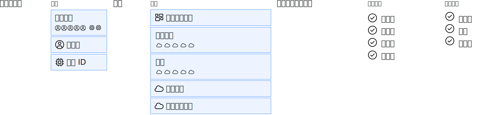

---

copyright:

  years: 2018, 2019

lastupdated: "2019-05-23"

keywords: frequently asked question, faq

subcollection: iam

---

{:shortdesc: .shortdesc}
{:codeblock: .codeblock}
{:screen: .screen}
{:new_window: target="_blank"}
{:tip: .tip}
{:faq: data-hd-content-type='faq'}
{:note: .note}

# 常見問題 (FAQ)
{: #iamfaq}

## 何謂 {{site.data.keyword.cloud_notm}} Identity and Access Management？
{: #whatisiam}
{: faq}

Identity and Access Management (IAM) 可讓您針對平台服務安全地鑑別使用者，並跨 {{site.data.keyword.cloud_notm}} 平台控制對資源的存取權。已啟用一組 IBM Cloud 服務以使用 Cloud IAM 來進行存取控制。那些服務已在您的帳戶內組織成資源群組，可讓使用者同時快速且輕鬆地存取多個資源。Cloud IAM 存取原則是用來指派使用者及服務 ID 對帳戶內資源的存取權。如需相關資訊，請參閱 [{{site.data.keyword.cloud_notm}} Identity and Access Management](/docs/iam?topic=iam-iamoverview#iamoverview)。

## 何謂啟用 IAM 的服務？
{: #iam-enabled}
{: faq}

啟用 IAM 的服務必須位於資源群組內，並透過使用 IAM 存取原則來提供服務的存取權。當您從型錄建立啟用 IAM 的服務時，您必須將它指派給資源群組。如需相關資訊，請參閱[何謂資源？](/docs/resources?topic=resources-resource#resource)

{{site.data.keyword.containerlong_notm}} 是唯一的例外；它由 IAM 存取控制，但一律會指派給 default 資源群組。因此，當您從型錄進行建立時，將不會提供您選項來進行選擇。而且，它不可以指派給任何其他資源群組。

## 何謂 IAM 存取原則？
{: #iam-policies}
{: faq}

IAM 存取原則是帳戶中的使用者、服務 ID 及存取群組如何被授與許可權，以便使用特定啟用 IAM 功能之服務或資源實例、管理資源群組或完成帳戶管理作業。每個 IAM 存取原則是由主體、目標及角色所組成。主體是具有存取權的人。目標是主體有權存取的項目。而角色（不論是平台還是服務角色，視所選目標的環境定義而定）則定義主體對目標有何種存取層次。 

主體是使用者、服務 ID 或存取群組。目標可以是帳戶中的服務、帳戶中的資源群組、特定的資源實例或類型，或是帳戶管理服務。而所提供作為選項的角色，取決於您的選取目標。部分服務具有已定義的服務特有角色，部分服務則只使用平台角色。若要以視覺化的方式瞭解此概念，請參閱下圖，它概述了建立 IAM 原則的選項：

## IAM 與 Cloud Foundry 是否相關？
{: #iam-cloudfoundry}
{: faq}

兩者不相關。Cloud Foundry 是使用組織、空間，以及 Cloud Foundry 角色來進行存取管理的開放程式碼平台。IAM 是鑑別平台服務使用者的安全方法，可透過使用資源群組及 IAM 存取角色來跨 {{site.data.keyword.cloud_notm}} 平台控制資源的存取。

這兩個存取管理系統完全不同。IAM 資源屬於資源群組，Cloud Foundry 資源則屬於組織及空間。IAM 存取原則用來提供對資源群組中資源的存取權。而 Cloud Foundry 組織及空間角色則是用來提供使用者對空間中 Cloud Foundry 資源的存取權。IAM 不會提供您對 Cloud Foundry 空間內任何物件的存取權，Cloud Foundry 角色則無法授與對資源群組內資源的存取權。

## 如何找出我可以存取什麼？
{: #iam-access}
{: faq}

請移至**管理** &gt; **存取 (IAM)**，然後在「使用者」頁面上選取您的名稱。接著，根據您要尋找的存取權來開啟不同的標籤：

* 若要判斷您透過獲指派之存取群組所取得的存取權，請選取**存取群組**。
* 若要查看指派給您的 IAM 存取原則，請選取**存取原則**。
* 若要查看您的 Cloud Foundry 對所有組織及空間的存取權，請選取 **Cloud Foundry 存取**。

## 如何要求資源的存取權？
{: #request-access}
{: faq}

帳戶擁有者可以更新您對帳戶中任何資源的存取權，或者，您也可以聯絡已經對服務或服務實例指派的管理者角色的任何使用者。

## 為何應該使用資源群組及存取群組？
{: #resource-groups}
{: faq}

資源群組是資源的邏輯容器。當資源完成建立時，會被指派給資源群組，而且在新增後即無法再移動。

存取群組用來輕鬆地將一組使用者及服務 ID 組織成單一實體來簡化存取權指派。您可以指派單一原則給存取群組，來將那些許可權授與所有成員。如果您有多個需要相同存取權的使用者或服務 ID，請建立存取群組，而不是針對個別使用者或服務 ID 重複多次指派相同的存取權。

藉由同時使用資源群組及存取群組，您可以透過指派數目有限的原則來簡化存取權指派。您可以將特定使用者及服務 ID 群組所需求的所有資源組織為單一資源群組，將所有使用者或服務 ID 分組成一個存取群組，然後指派可以提供資源群組中所有資源存取權的單一原則。

如需相關資訊，請參閱[指派存取權的最佳作法](/docs/iam?topic=iam-account_setup#account_setup)。

## 如何確定我的使用者可以在資源群組內建立資源？
{: #resources}
{: faq}

若要在資源群組中建立資源，使用者必須具備兩個存取原則：一個指派給資源群組本身，一個指派給群組中的資源。資源群組本身的存取權只不過是對組織資源之容器的存取權，此類型的原則容許使用者檢視、編輯或管理群組的存取權，但不容許針對其中的資源。對資源群組內服務的存取權可讓使用者使用服務實例，這表示使用者可以建立服務實例。

因此，使用者必須至少具有下列存取權：

* 資源群組本身的檢視者角色或更高的角色
* 資源群組中某個服務或所有服務的編輯者角色或更高的角色

## 需要有何種存取權才能夠將存取權提供給其他人？
{: #user-access}
{: faq}

對於已啟用 IAM 的服務，您必須具有要將存取權指派給使用者之服務或資源的「管理者」角色。如果您要指派對帳戶中所有服務或資源的存取權，則需要具有「管理者」角色且已啟用「身分及存取」之所有服務的原則。此外，若要指派使用者對帳戶管理服務的存取權，您必須獲指派特定服務或所有帳戶管理服務上的「管理者」角色。

對於 Cloud Foundry 服務，您必須具有 Cloud Foundry 組織及空間管理員角色，才能存取 Cloud Foundry 資源。

若為標準基礎架構，您必須對要提供使用者存取權的資源具有「管理使用者」標準基礎架構許可權，以及服務和裝置種類許可權。

## 管理資源群組的存取權與對資源群組內資源的存取權之間有何差別？
{: #providing-access}
{: faq}

當您具有管理資源群組的存取權時，您可以檢視、編輯名稱，以及根據指派的角色來管理資源群組本身的存取權。對資源群組本身的存取權不會將對群組內資源的存取權提供給使用者。

當您對資源群組內資源具有存取權時，您可以編輯、刪除及建立實例，或者根據指派的角色而擁有資源群組內指定服務的所有管理動作。

例如，帳戶管理服務的平台管理角色及動作，請參閱[平台角色表](/docs/iam?topic=iam-userroles#platformrolestable2)。

## 誰可以移除使用者？
{: #remove-users}
{: faq}

帳戶擁有者可以移除帳戶中的任何使用者，而且任何具有下列存取權的使用者都可以移除帳戶中的使用者：

* 具有已指派「管理者」角色之「使用者管理」帳戶管理服務的 IAM 原則，以及 Cloud Foundry 組織管理員（如果使用者屬於 Cloud Foundry 組織）。
* 如果您的帳戶中有標準基礎架構，則使用者必須具有已指派「管理者」角色之「使用者管理」帳戶管理服務的 IAM 原則、必須為 Cloud Foundry 組織管理員（如果使用者屬於 Cloud Foundry 組織），以及必須為已指派「管理使用者」標準基礎架構許可權之標準基礎架構使用者階層中的使用者上代。

## 如何針對我的帳戶要求 IBM ID 多因子鑑別？
{: #multi-factor}
{: faq}

1. 移至**管理** &gt; **存取 (IAM)**，然後選取**設定**。
2. 從帳戶登入區段，選取**更新**以為所有使用者選取 MFA，或是只為非聯合使用者選取 MFA。

如需相關資訊，請參閱[針對帳戶中的使用者要求 MFA](/docs/iam?topic=iam-enablemfa#enablemfa)。

## 服務角色與平台角色之間有何差異？
{: #service-platform-roles}
{: faq}

服務角色及平台角色是兩種不同類型的角色：

* 平台角色與您如何使用帳戶內的服務相關，例如，建立實例、連結實例，以及管理使用者對服務的存取權。例如，對於平台服務，這些角色可讓使用者建立資源群組及管理服務 ID。平台角色包括：管理者、編輯者、操作員，以及檢視者。

* 服務角色定義可對服務執行動作的能力，而且依每個服務而不同，例如，執行 API 呼叫或存取使用者介面。服務角色包括：管理員、撰寫者和讀者。如需如何套用這些角色的相關資訊，請參閱特定的服務文件。

## 資源群組與 Cloud Foundry 組織及空間之間的差異為何？
{: #groups-organizations}
{: faq}

在 {{site.data.keyword.Bluemix_notm}} 一開始，有一個用於存取控制及資源組織的開放程式碼平台服務（稱為 Cloud Foundry），便是組織及控制資源存取的唯一方法。隨著 {{site.data.keyword.Bluemix_notm}} 逐漸發展，可供所有類型的服務及資源使用之新方法的需求應運而生。資源群組現在用來分組及組織多種類型的資源，IAM 則用來對服務及資源的存取進行一致性控制。目前已經使用資源群組及 IAM 來採用一些服務，其他服務將隨時移動作為組織資源及管理存取的新方法。

存取控制及帳戶資源組織是資源群組與 Cloud Foundry 組織及空間之間的主要差異。資源群組可組織帳戶中使用 IAM 原則來進行存取控制的啟用 IAM 的服務。組織及空間則透過對存取控制使用 Cloud Foundry 角色來進行管理，Cloud Foundry 資源已指派給空間。組織和空間僅可用來組織及控制 Cloud Foundry 領域內的資源存取，資源群組和 IAM 則可用於跨 {{site.data.keyword.Bluemix_notm}} 的多類型資源。

## 如何委派帳戶管理者功能？  
{: #account-administrator}
{: faq}

若要委派帳戶管理者功能，請指派下列存取權：

* 具有所有已啟用「身分及存取」之服務的「管理者」和「管理員」角色的 IAM 原則，這可讓使用者建立服務實例，並指派使用者對帳戶中所有資源的存取權。
* 具有「所有」帳戶管理服務的「管理者」角色的 IAM 原則，這可讓使用者完成邀請及移除使用者、管理存取群組、管理服務 ID、管理專用型錄供應項目以及追蹤計費與用量這類作業。
* 標準基礎架構的「超級使用者」許可權集
* 所有組織的 Cloud Foundry 管理員

## 如何指派基礎架構及裝置的存取權？
{: #infrastructure-devices}
{: faq}

1. 移至**管理** &gt; **存取 (IAM)**，然後選取**使用者**。
2. 選取使用者的名稱。
3. 按一下**標準基礎架構**。
4. 從**許可權**區段中指派許可權、從**裝置**區段中指派裝置存取權，以及從 **VPN 存取**區段中指派使用者獲指派存取權之裝置的 VPN 子網路存取權。

## 對於先前在 SoftLayer 帳戶中指派計費及支援許可權的使用者，如何管理其存取權？
{: #migrated-permissions-faq}
{: faq}

先前在 SoftLayer 帳戶中指派的所有許可權，都可以在 {{site.data.keyword.Bluemix_notm}} 主控台中進行管理。現在，[已移轉許可權存取群組](/docs/iam?topic=iam-migrated_permissions)提供了用來管理計費資訊及支援案例的帳戶許可權。先前在 SoftLayer 帳戶中指派了這些許可權的所有使用者都已移轉至這些存取群組，而這些存取群組可透過存取群組上的 IAM 原則指派相同的存取層次。

## 我帳戶中的每位使用者都可以看到所有其他使用者嗎？
{: #users}
{: faq}

帳戶擁有者可以檢視帳戶中的所有使用者，並選擇使用者如何在「使用者」頁面上檢視帳戶中的其他使用者。帳戶擁有者可以在「設定」頁面上選取下列其中一個選項，來調整[使用者清單可見性設定](/docs/iam?topic=iam-userlistview#userlistview)：

* **未限定視圖**：您帳戶中的所有使用者都可以檢視帳戶中的其他每個人。
* **受限視圖**：將在「使用者」頁面上檢視使用者的能力限制為僅檢視已獲授與明確存取權的使用者，以及可以透過共用 Cloud Foundry 組織或標準基礎架構使用者階層關係來檢視其他使用者的使用者。

## 當我邀請使用者加入帳戶時，是否需要指派該使用者的存取權？
{: #account-invite}
{: faq}

是。您必須在三個存取管理系統的其中一個內指派使用者存取權：

* 資源、資源群組或帳戶管理服務上的 IAM 存取原則
* 組織及空間的 Cloud Foundry 角色
* 標準基礎架構的許可權集

## 如何將鑑別新增至我的 Web 及行動應用程式？
{: #appid}
{: faq}

IAM 用來管理您 {{site.data.keyword.cloud_notm}} 服務及資源的存取權。使用 {{site.data.keyword.appid_full_notm}}，您可以將鑑別新增至 Web 及行動應用程式，進一步執行雲端安全。只要幾行程式碼，就可以輕鬆地保護 {{site.data.keyword.cloud_notm}} 上所執行的雲端原生應用程式及服務。準備好要開始了嗎？[請參閱文件](/docs/services/appid?topic=appid-getting-started#getting-started)。
