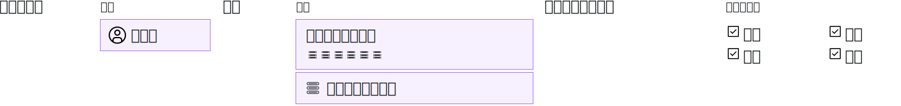

---

copyright:

  years: 2017, 2019

lastupdated: "2019-05-14"

keywords: SoftLayer permissions, classic infrastructure access, classic infrastructure permission, migrated SoftLayer permissions, migrated permission access group

subcollection: iam

---

{:shortdesc: .shortdesc}
{:codeblock: .codeblock}
{:screen: .screen}
{:important: .important}
{:new_window: target="_blank"}

# 標準基礎架構許可權
{: #infrapermission}

當您邀請使用者加入您的帳戶時，可以從指派大量存取權的三個標準基礎架構許可權集中進行選取：「僅檢視」、「基本使用者」、「超級使用者」。
{:shortdesc}

當您邀請某人加入帳戶時，只有您、帳戶擁有者或具有「管理使用者」標準基礎架構許可權的使用者，才能調整使用者的許可權。如果您不是帳戶擁有者，則只能指派您已獲指派的許可權層次或許可權子集。帳戶擁有者可以更新帳戶中任何人的許可權，以擁有任何層次的存取權。

使用者接受邀請之後，即可設定額外的許可權。例如，邀請時所指派的起始許可權集不會授與裝置的存取權。因此，在使用者接受邀請之後，您必須授與裝置存取權。如需相關資訊，請參閱[管理標準基礎架構存取](/docs/iam?topic=iam-mngclassicinfra#mngclassicinfra)。

下圖顯示如何為每位使用者指派標準基礎架構許可權。您可以藉由從精細許可權選項進行選取，自訂每位使用者的存取權，來授與每位使用者對標準基礎架構服務或裝置的存取權。

{: caption="圖 1. 選取使用者、裝置或服務，然後選取任何精細許可權組合，來指派標準基礎架構存取權" caption-side="bottom"}

## 已移轉標準基礎架構許可權
{: #predefined}

用於檢視與管理計費資訊以及使用支援案例的標準基礎架構許可權集，現在已移轉至存取群組。您帳戶中先前獲指派這些許可權的使用者，現在已指派給個別移轉的許可權存取群組。因此，使用 IAM 存取原則，即可直接管理標準基礎架構許可權。如需已移轉許可權以及用於各許可權的存取群組的相關資訊，請參閱[管理已移轉 SoftLayer 帳戶許可權](/docs/iam?topic=iam-migrated_permissions)。
